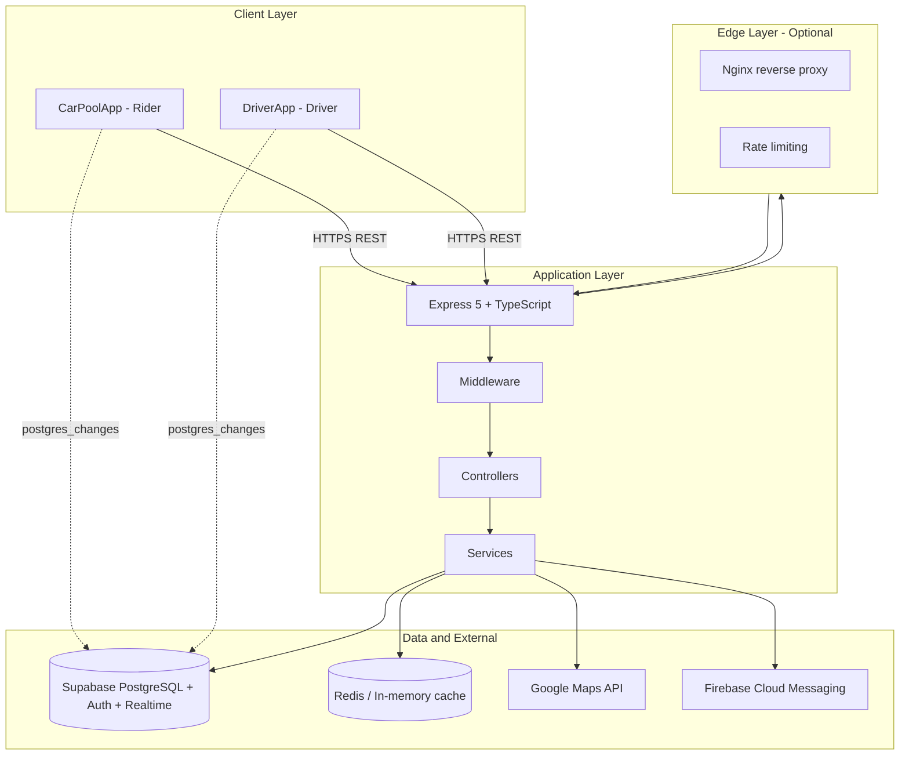
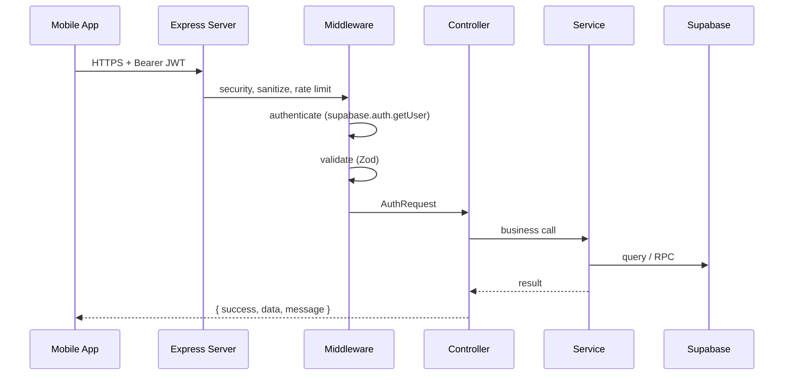
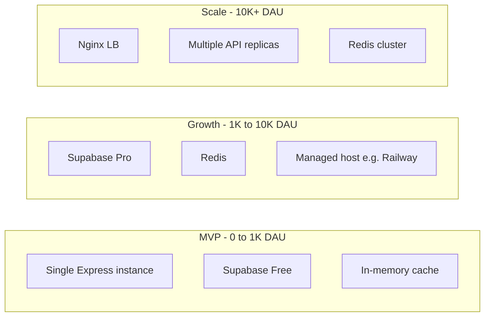
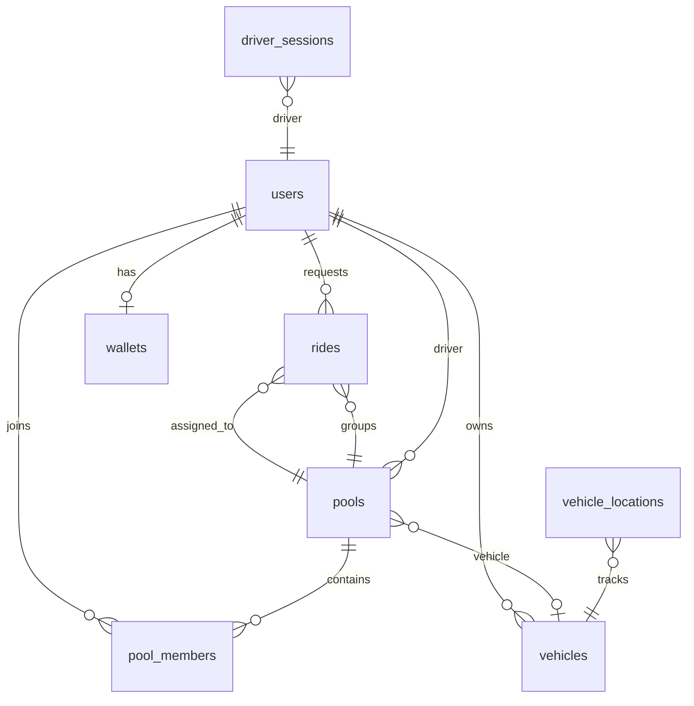
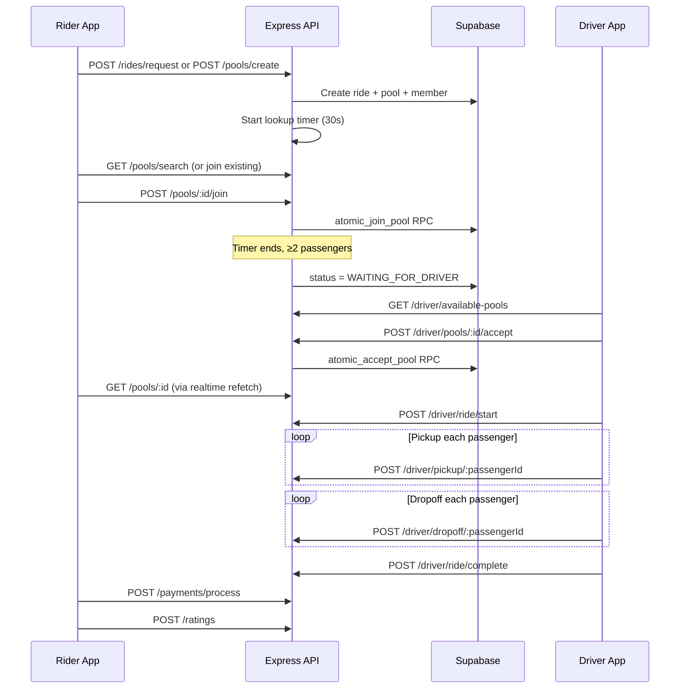
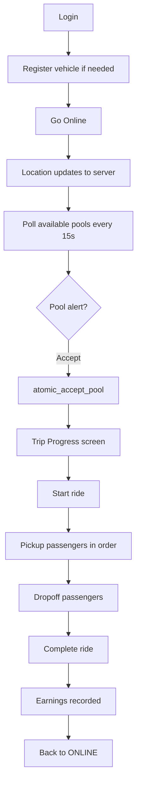
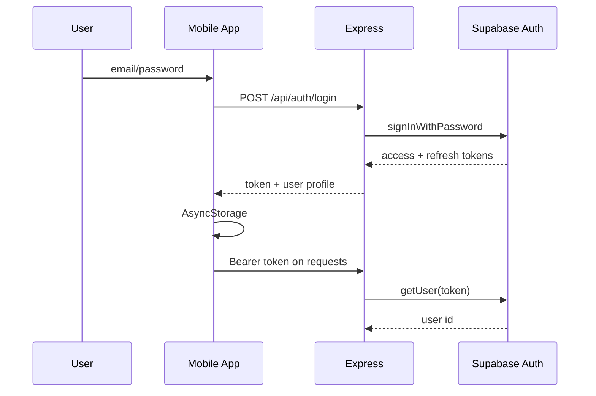
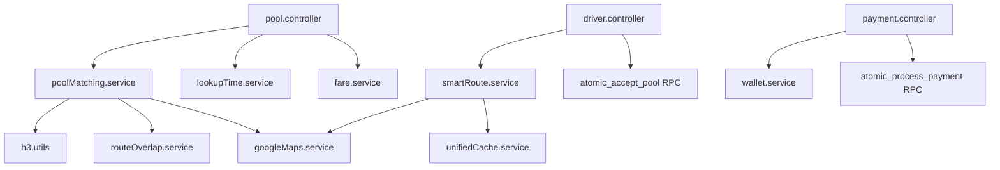

# RidePool — System Prompt (Authoritative Knowledge Base)

**Product name:** RidePool (also referred to as CarPool in repository paths)  
**Version:** 1.2.0  
**Last consolidated:** 2026-05-31  
**Audience:** LLMs, AI agents, developers, and contributors  
**Primary sources:** `__docs__/`, `Server/`, `Client/`, `shared/`

> This document is self-contained. You should not need other project documentation to understand architecture, domain rules, or implementation patterns. Where behavior is uncertain, items are labeled **Implemented**, **Partial**, **Planned**, or **Assumption**.

### Confirmed product decisions (do not revisit)

| Area | Decision | Notes |
|------|----------|-------|
| **Push notifications** | **Firebase Cloud Messaging (FCM)** | Sole notification delivery provider. Do not introduce Knock, OneSignal, or similar. |
| **Maps & routing** | **Google Maps only** | Fully implemented across server, CarPoolApp, and DriverApp. **Mapbox will never be used** — ignore legacy Mapbox env vars in `.env.example` files. |

---

## Table of Contents

1. [Project Overview](#project-overview)
2. [System Architecture](#system-architecture)
3. [Technology Stack](#technology-stack)
4. [Repository Structure](#repository-structure)
5. [Domain Knowledge](#domain-knowledge)
6. [Pool Matching & Route Algorithms](#pool-matching--route-algorithms)
7. [Features](#features)
8. [Client Applications](#client-applications)
9. [End-to-End User Flows](#end-to-end-user-flows)
10. [API Architecture](#api-architecture)
11. [Complete API Endpoint Reference](#complete-api-endpoint-reference)
12. [Database Design](#database-design)
13. [Security Model](#security-model)
14. [Development Guidelines](#development-guidelines)
15. [Future Feature Implementation Guide](#future-feature-implementation-guide)
16. [LLM Development Context](#llm-development-context)
17. [Decision Log](#decision-log)
18. [Operations & Disaster Recovery](#operations--disaster-recovery)
19. [Current Status](#current-status)
20. [Troubleshooting](#troubleshooting)

---

# Project Overview

## Project purpose

RidePool is a **production-grade carpooling platform** built for **Bangladesh** (primary focus: **Dhaka**). Unlike ride-hailing apps (Uber, Pathao) that optimize for solo trips, RidePool optimizes for **shared rides** so passengers split cost on similar routes.

## Core objectives

| Objective | Description |
|-----------|-------------|
| **Cost savings** | 25–40% savings vs solo rides via intelligent pooling |
| **Fast matching** | Match riders within ~40 seconds using H3 geospatial indexing |
| **Preference matching** | Female-only pools via gender-restricted matching |
| **Social pooling** | Priyo Sathi (trusted companions) for preferential matching |
| **Platform sustainability** | ~20% platform commission; MVP deployable at $0/month infra |
| **Cross-platform** | Single codebase: iOS, Android, Web via Expo (rider app only for web) |

## Target users

| Actor | App | Role |
|-------|-----|------|
| **Passenger (Rider)** | `Client/CarPoolApp` | Search/create/join pools, pay, chat, ratings |
| **Driver** | `Client/DriverApp` | Go online, accept pools, navigate, pickup/dropoff, earnings |
| **Platform admin** | Future / DB `is_admin` | Moderation, analytics (limited UI today) |

## Key business problems being solved

1. **High solo ride cost** in dense urban traffic — pooling splits fare fairly.
2. **Inefficient empty seats** — sedans/CNGs carry multiple passengers on one optimized route.
3. **Gender preference for riders** — gender-restricted matching (`FEMALE_ONLY` vs `ANY`).
4. **Unreliable informal carpooling** — structured pools, lookup timers, atomic join/accept.
5. **Trust between strangers** — ratings and Priyo Sathi.

### Business model (Implemented assumptions)

- **Platform commission:** 20% of collected fare.
- **Driver retention:** 80% of fare; daily bonus ৳100 per 3 completed trips (**Implemented** in `incentive.service.ts` — service exists but not wired to routes).
- **Hidden platform surcharge:** ৳10 per passenger charge (**Implemented** in `fare.service.ts`, hardcoded — not read from `PLATFORM_SURCHARGE_BDT` env).
- **Minimum pool viability:** Ride should not proceed with only 1 passenger + driver; lookup rules require **≥2 passengers** before driver assignment / start (**Implemented** in lookup timer + driver accept validation).

### Scale metrics (documented)

| Metric | Count |
|--------|-------|
| DB tables | 44 |
| API endpoints | 120+ |
| Route files | 21 |
| Controllers | 22 |
| Services | ~35 (some unwired) |
| CarPoolApp screens | ~30 |
| DriverApp screens | ~11 |
| Shared types | 80+ (package exists, not imported by clients) |

---

# System Architecture

## High-level architecture



## Component relationships

| Layer | Responsibility | Must not |
|-------|----------------|----------|
| **Routes** | HTTP mapping, middleware attachment | Contain business logic |
| **Controllers** | Parse request, auth checks, call services, format JSON | Direct complex DB logic |
| **Services** | Business rules, caching, external APIs | Use `req`/`res` objects |
| **Middleware** | Auth, validation, rate limits, sanitization | Implement domain rules |
| **Clients** | UI, local state, API calls, Supabase subscriptions | Duplicate fare/matching logic |

## Data flow (typical authenticated request)



## External integrations

| Integration | Status | Purpose |
|-------------|--------|---------|
| **Supabase** | **Implemented** | DB, Auth, Realtime, RLS |
| **Google Maps** | **Implemented** | **Sole maps provider.** Directions API, traffic ETA, polylines, Places, Static Maps (Expo Go fallback), deep links. Server: `googleMaps.service.ts`; clients: `react-native-maps` + `@react-google-maps/api`. |
| **Google Maps deep links** | **Implemented** | Turn-by-turn in external Google Maps app (no API cost) |
| **Firebase Cloud Messaging** | **Implemented** | **Sole push provider.** Server sends via `FCM_SERVER_KEY`; clients register tokens via `expo-notifications` → `POST /users/device-token`. Requires Firebase project setup for production delivery. |
| **Redis** | **Optional** | Route/pool cache (`MVP_MODE` uses memory) |
| **Payment gateways** | **Partial** | Wallet + cash wired; card/mobile banking placeholder |
| **BullMQ** | **Partial** | Package present; **not initialized** in `app.ts` |

> **Out of scope (never use):** Mapbox, Knock.app, OneSignal, and any alternative maps or notification providers. Legacy references in older docs or `.env.example` files should be ignored or removed during cleanup.

## Service boundaries

- **Single modular monolith** (`Server/`) — not microservices today.
- **Two mobile apps** share one API and one database schema.
- **Realtime** is **client-side Supabase channels**, not a custom WebSocket server on Express.
- **Shared types** live in `shared/` (`@ridepool/shared-types`) — **not currently imported by client apps**; each app maintains local types.

---

# Technology Stack

## Frontend technologies

| Component | Technology | Notes |
|-----------|------------|-------|
| Framework | React Native 0.81.5 | Both apps |
| Toolkit | Expo 54 | Dev builds, EAS |
| Routing | Expo Router 6 | File-based `app/` routes |
| State | Zustand 5 + React Context | Auth, global trip, driver online |
| Styling | NativeWind 4 + Tailwind 3 | Utility-first |
| Maps (native) | react-native-maps 1.20 | Google provider only — **no Mapbox** |
| Maps (web) | @react-google-maps/api + Leaflet fallback | CarPoolApp web only; Google is primary |
| Push notifications | Firebase (FCM) via expo-notifications | **Only** notification provider |
| Storage | AsyncStorage | Tokens, active trip persistence |
| Realtime | `@supabase/supabase-js` | `postgres_changes` + polling fallback |
| Validation | Zod | DriverApp types; server Zod v4 |
| Testing | Jest | CarPoolApp has 4 test files; DriverApp none |

## Backend technologies

| Component | Technology |
|-----------|------------|
| Runtime | Node.js 20+ |
| Framework | Express 5.1 |
| Language | TypeScript 5.9 (CommonJS on server) |
| Validation | Zod 4 |
| Geospatial | h3-js 4.3 + PostGIS (DB) |
| Cache | Redis (ioredis) or in-memory |
| Logging | Winston + Morgan |
| Resilience | Opossum circuit breaker (defined, unused) |
| Testing | Vitest 4 |

## Database systems

- **PostgreSQL 15** via **Supabase**
- **PostGIS** for geospatial columns
- **RLS** on most application tables; some cache/metadata tables are intentionally broader or missing policies
- **Atomic RPCs:** `atomic_join_pool`, `atomic_accept_pool`, `atomic_wallet_debit`, `atomic_process_payment`, etc.

## Infrastructure

| Mode | File | Characteristics |
|------|------|-----------------|
| **MVP** | `Server/docker-compose.mvp.yml` | Single API, `MVP_MODE=true`, no Redis |
| **Production** | `Server/docker-compose.yml` | API replicas, Redis, Nginx |
| **CI** | `.github/workflows/` | ci, codeql, e2e, expo-preview, security-scan |

## Deployment architecture



| Phase | DAU | Cost/month |
|-------|-----|------------|
| MVP | 0–1K | $0 |
| Growth | 1K–10K | $50–200 |
| Scale | 10K–50K | $200–500 |
| Enterprise | 50K+ | $1,500+ |

**Health checks:** `GET /health/live` (used by Docker probes).

## Third-party services

- **Google Maps** — routing, geocoding, traffic-aware combined routes, deep links, Static Maps for Expo Go fallback (**sole maps provider; Mapbox excluded**)
- **Firebase Cloud Messaging (FCM)** — push notifications for rider and driver apps (**sole notification provider**)
- Supabase (DB, auth, realtime)
- Expo Application Services (mobile builds)

---

# Repository Structure

## Monorepo layout

```
Carpool-dev/
├── Server/                 # Express API (source of business truth)
├── Client/
│   ├── CarPoolApp/         # Rider app (Expo) — flat layout, web + native
│   └── DriverApp/          # Driver app (Expo) — src/ layout, native only
├── shared/                 # @ridepool/shared-types (not wired to clients)
├── __docs__/               # Human documentation (consolidated here)
├── System_Prompt.md        # This file
├── app.json                # Root Expo config
├── eas.json                # EAS build profiles
└── package.json            # Root scripts (limited)
```

> **Important:** There is **no npm workspace** at root. Install dependencies **per package** (`Server/`, `Client/CarPoolApp/`, `Client/DriverApp/`, `shared/`).

## Important directories

| Path | Purpose |
|------|---------|
| `Server/src/routes/` | 21 route modules mounted at `/api` |
| `Server/src/controllers/` | 22 HTTP handlers |
| `Server/src/services/` | ~35 business services (some unwired) |
| `Server/src/middleware/` | Auth, validation, rate limits, errors, authorization (unused on routes) |
| `Server/supabase/migrations/` | SQL schema and RPC definitions |
| `Client/CarPoolApp/app/` | Rider screens (Expo Router) |
| `Client/CarPoolApp/hooks/usePoolRealtime.ts` | Core passenger realtime hook |
| `Client/DriverApp/src/` | Driver components, services, store |
| `shared/src/` | Cross-app TypeScript types |

## Critical files

| File | Responsibility |
|------|----------------|
| `Server/src/app.ts` | Express bootstrap, middleware order, cache connect |
| `Server/src/routes/index.ts` | Route aggregator |
| `Server/src/services/poolMatching.service.ts` | H3 matching + scoring |
| `Server/src/services/smartRoute.service.ts` | Combined route cache + waypoint order |
| `Server/src/services/lookupTime.service.ts` | 30s + 10s search timers |
| `Server/src/services/fare.service.ts` | Fare + discounts + surcharge |
| `Server/src/services/googleMaps.service.ts` | Directions API, traffic ETA |
| `Client/CarPoolApp/contexts/GlobalContext.tsx` | Active trip persistence |
| `Client/CarPoolApp/hooks/usePoolRealtime.ts` | Pool realtime + polling |
| `Client/DriverApp/src/store/useDriverStore.ts` | Driver online + active pool (persisted) |
| `Client/DriverApp/src/services/driver.service.ts` | Driver API calls (uses `/combined-route` for trip routing) |

---

# Domain Knowledge

## Core business entities



| Entity | Definition |
|--------|------------|
| **User** | Account in `users`; may be rider and/or driver (`is_driver` flag) |
| **Ride** | One passenger trip request (pickup → dropoff) |
| **Pool** | Shared ride group (1–4 passengers, one driver when assigned) |
| **Pool member** | Join record linking user + ride to pool |
| **Vehicle** | Driver's CAR or CNG |
| **Driver session** | ONLINE / BUSY / OFFLINE work session |
| **Wallet** | Prepaid balance for automatic ride payment |
| **Priyo Sathi** | Trusted companion relationship (max 5 per user) |
| **Promise money** | ৳50 anti-cancellation deposit (DB + RPC exist) |

## Terminology

| Term | Meaning |
|------|---------|
| **H3 index** | Uber hexagonal cell ID for geospatial matching |
| **Lookup time (LT)** | Window to form pool (~30s + optional 10s extension) |
| **Priyo Sathi** | Trusted companion (max 5); preferential matching |
| **Female-only** | Pool gender mode: only female passengers |
| **Combined route** | Multi-stop path: driver → pickups → dropoffs |
| **Promise money** | ৳50 deposit to discourage cancellations (**DB + RPC exist**; product flow **Partial**) |
| **Purple zone** | Designated pooling hotspot for walk suggestions (**Planned** UI) |
| **Walk-to-pickup** | Suggest 100–200m walk to main road (**Planned** in product spec) |
| **Viability score** | Pool match quality 0–100 from H3 + route scoring |

## Entity relationships and rules

1. A **ride** belongs to at most one active **pool** at a time.
2. A **pool** has one **driver** after acceptance (`atomic_accept_pool`).
3. **Pool capacity:** `max_passengers` typically 4 (CAR) or 3 (CNG) — verify `vehicle_type` in code.
4. **Minimum passengers for driver accept:** ≥2 (**Implemented**).
5. **Gender:** `FEMALE_ONLY` pools only match female riders (**Implemented**).
6. **Fare recalculates** when members join/leave (**Implemented**).
7. **Cooldown:** 3 deliberate cancellations within 5 minutes → 7-minute cooldown (**Implemented**).

## Pool status state machine (Implemented)

```
WAITING_FOR_RIDERS → WAITING_FOR_DRIVER → READY_TO_START → STARTED → COMPLETED
                              ↓ (any pre-STARTED)
                          CANCELLED
```

## Ride status (Implemented)

```
CREATING_POOL → WAITING_FOR_POOL → MATCHED → STARTED → COMPLETED
                                              ↘ CANCELLED
```

---

# Pool Matching & Route Algorithms

## Pool matching (3 phases) — **Implemented**

**Service:** `poolMatching.service.ts`

### Phase 1: Database filter (H3)

1. Convert pickup coords to H3 resolution **9**, destination to resolution **7**
2. Search hex rings around pickup and destination
3. SQL filter by: vehicle type, pool status (`WAITING_FOR_RIDERS`), capacity, gender mode, cooldown
4. Exclude pools user already belongs to

### Phase 2: Scoring (0–100)

| Component | Max Points | Description |
|-----------|------------|-------------|
| Pickup distance | 25 | Closer pickup = higher score |
| Route overlap | 35 | Percentage of route shared |
| Common hexagons | 20 | Shared H3 cells (fill ratio) |
| Destination proximity | 10 | Dropoff closeness |
| Exact pickup bonus | 5 | Same H3 cell at res 9 |
| Exact destination bonus | 5 | Same H3 cell at res 7 |

- **Minimum match score:** 30 (pools below threshold excluded)
- **Sort:** Highest score first, then lowest detour

### Phase 3: Google Maps enrichment

- Only top **3–5** matches enriched with Directions API
- Route overlap calculated via `routeOverlap.service.ts`
- **10-minute route cache** to control API costs
- If no Google key: H3-only matching still works

## Smart route algorithms — **Implemented**

**Service:** `smartRoute.service.ts`

### 1. Waypoint ordering (greedy nearest neighbor)

- Start at driver location (or pickup centroid)
- Greedy nearest-neighbor across remaining pickups and eligible dropoffs
- **Constraint:** Dropoff only eligible after corresponding pickup
- Complexity: O(n²) time, O(n) space
- Trade-off: Fast but not globally optimal TSP

### 2. One-shot route caching

- First request computes Google Maps route, caches for full trip window (~2 hours pool-level)
- Subsequent requests return cached polyline + ETA
- ETA adjusted by subtracting elapsed time (clamped to min 1 minute)
- Cache key: H3 cells (pickup res 9, dropoff res 7) + `optimizeFor` option

### 3. Off-route detection

- `calculateDistanceToRoute`: min distance from point to polyline
- `POST /api/pools/:id/combined-route/update` exists but returns `needsRecalculation: false` (**Partial** — off-route recalc not wired)

### 4. Cache key generation

- H3 hex indexing clusters nearby locations for stable cache keys
- Driver location uses res 9 (or res 7 if `useCoarseDriverLocation`)

---

# Features

For each feature: status is marked **Implemented**, **Partial**, or **Planned**.

---

## 1. Authentication & user profile — **Implemented**

**Purpose:** Register, login, session management, profile.

**User flow:** Login/register → token stored in AsyncStorage → `GET /api/auth/me` on app start.

**Backend flow:** Supabase Auth issues JWT → `authenticate` middleware validates via `supabase.auth.getUser(token)`.

**Database:** `users`, `auth.users` (Supabase), wallet created on registration.

**APIs:** `/api/auth/register`, `/login`, `/logout`, `/refresh`, `/me`, `/reset-password`, `/change-password`

**Notes:** CarPoolApp supports OAuth (Google/Facebook) via Supabase. DriverApp uses email/password only. DriverApp does not auto-login on restart.

---

## 2. Pool search & matching (H3) — **Implemented**

**Purpose:** Find compatible pools by pickup/destination similarity.

**User flow:** Enter pickup/destination → searching screen → list of pools with fare/savings.

**Backend flow:** See [Pool Matching & Route Algorithms](#pool-matching--route-algorithms).

**Database:** Reads `pools`, `pool_members`, `rides`; uses H3 index columns.

**APIs:** `GET /api/pools/search`, `POST /api/pools` or `/create`

**Key files:** `poolMatching.service.ts`, `routeOverlap.service.ts`, `poolSearchResponse.service.ts`

---

## 3. Pool create & join — **Implemented**

**Purpose:** Create new pool or join existing.

**User flow:** Select pool or create → join → waiting for more riders/driver.

**Backend flow:**
1. Check cooldown (`penalty.service.ts`)
2. Insert `rides` + `pools` + `pool_members`
3. Start lookup timer (`lookupTime.service.ts`)
4. Join uses `atomic_join_pool` RPC (prevents overbooking)

**APIs:** `POST /api/pools/create`, `POST /api/pools/:id/join`, `POST /api/pools/:id/leave`, `POST /api/pools/:id/cancel`

---

## 4. Lookup time & auto transitions — **Implemented**

**Purpose:** Enforce search window; cancel or advance pool when timer ends.

**Rules (Implemented):**
- Initial window **30s**, extend **+10s** via `/extend-search` (hardcoded in `lookupTime.service.ts`, not env)
- If **<2 passengers** when timer ends → cancel
- If **≥2 passengers** → `WAITING_FOR_DRIVER`

**APIs:** `POST /api/pools/:id/extend-search`, `POST /api/pools/:id/complete-search`

**Service:** `lookupTime.service.ts`

---

## 5. Driver go-online & pool discovery — **Implemented**

**Purpose:** Drivers see nearby pools waiting for assignment.

**User flow:** Toggle online → map/list of pools → alert with accept/reject.

**Backend flow:** Create `driver_sessions`, update `vehicle_locations`, query pools by H3 proximity.

**APIs:** `POST /api/driver/go-online`, `POST /go-offline`, `GET /available-pools`, `PUT /location`

**Client:** DriverApp polls available pools every **15s** when online.

---

## 6. Driver accept pool (atomic) — **Implemented**

**Purpose:** Assign driver without race conditions.

**Backend:** `atomic_accept_pool` RPC → status `READY_TO_START`, driver `BUSY`, clear route cache for recalculation.

**API:** `POST /api/driver/pools/:poolId/accept`

---

## 7. Trip lifecycle (start, pickup, dropoff, complete) — **Implemented**

| Step | API | DB impact |
|------|-----|-----------|
| Start | `POST /api/driver/ride/start` | `pools.status=STARTED`, rides `STARTED` |
| Pickup | `POST /api/driver/pickup/:passengerId` | ride `picked_up_at` |
| Dropoff | `POST /api/driver/dropoff/:passengerId` | ride `COMPLETED` |
| Complete | `POST /api/driver/ride/complete` | pool `COMPLETED`, earnings row, driver `ONLINE` |

**Client:** `TripProgress.native.tsx` in both apps; `usePoolRealtime` for live updates.

**Route parity:** DriverApp and CarPoolApp both call `GET /pools/:id/combined-route` for traffic-aware smart route data. The legacy `GET /pools/:id/route` endpoint remains on the server for compatibility.

---

## 8. Real-time updates — **Implemented** (with constraints)

**Purpose:** Live pool status, members, messages.

**Architecture:**
- Supabase `postgres_changes` on `pools`, `pool_members`, `messages`, `notifications`, `rides`, `vehicle_locations`
- **Always refetch full pool via API** on UPDATE (realtime payload lacks joins)
- Polling fallback: **3s** when disconnected, **30s** heartbeat when connected
- Chat: **2s poll** as primary in `useChatRealtime.ts`

**Not implemented:** Custom Express WebSocket server.

---

## 9. Fare calculation — **Implemented**

**Formula (CAR example):**
```
baseFare = 50 + (km × 15)
timeFare = minutes × 2
discount = 25% (2 pax) | 35% (3) | 40%+5% bonus (4)
farePerPerson = ceil((baseFare + timeFare - discount) / count)
charge = farePerPerson + 10 (platform surcharge)
```

**Driver earnings:** `totalFare × 80%` after 20% commission.

**Service:** `fare.service.ts`, `rideEstimation.service.ts`

---

## 10. Wallet & payments — **Partial**

**Implemented (backend):** Wallet balance, top-up endpoints, debit on ride, transaction history, cash payment recording.

**Partial (client):** CarPoolApp wallet screen has **hardcoded balance "0 taka"** and mock payment methods — does not call wallet API despite `payment.service.ts` existing.

**Partial (gateways):** Card/mobile banking (bKash/Nagad/Rocket) gateway stubs — not production-wired.

**APIs:** `/api/wallet/*`, `POST /api/payments/process`

**RPCs:** `atomic_wallet_debit`, `atomic_process_payment`

---

## 11. Priyo Sathi — **Implemented** (core); advanced auto-match **Partial**

**Implemented:** Add/remove companions, requests, invites, nearby check, cancellation penalty via `deduct_promise_money` in some flows.

**Planned per PRD:** Auto gang-up queue, in-range detection, private queue — verify UI parity before assuming complete.

**APIs:** `/api/priyo-sathi/*`

---

## 12. Messaging — **Implemented**

**APIs:** `POST /api/messages/`, `GET /conversations`, realtime via `useChatRealtime.ts` (2s poll fallback).

**Tables:** `messages`, `conversations`, `conversation_participants`

---

## 13. Ratings — **Implemented**

Post-trip `POST /api/ratings` updates `users.average_rating`.

---

## 14. Navigation & combined route — **Implemented**

**APIs:**
- `GET /api/pools/:id/combined-route` (traffic-aware, preferred)
- `GET /api/pools/:id/route` (legacy)
- `GET /api/pools/:id/navigation-link`
- `POST /api/navigation/deep-link`

**Service:** `smartRoute.service.ts` — greedy nearest-neighbor waypoint ordering with pickup-before-dropoff constraint.

**Map UI:** Polylines + markers; traffic overlay in-app **not enabled** (deep link has traffic).

---

## 15. Cooldown / cancellation penalties — **Implemented**

**Rules:** 3 deliberate cancellations within 5 minutes → cooldown; cancellations within 30s not counted deliberate.

**Tables:** `user_cancellations`, `cooldown_periods`

**Service:** `penalty.service.ts`

---

## 16. Analytics and offline — **Implemented** (API level)

Backend routes exist for analytics and offline sync; admin dashboards and full client consumption may be **Partial**.

**Unwired services (exist but no route wiring):** `geofencing.service.ts`, `incentive.service.ts`, `tracing.service.ts`, `h3Sync.service.ts`, `routeCache.service.ts`, `h3Worker.service.ts`, `route.service.ts` (stubs).

---

## 17. Gender-based matching — **Implemented**

Females choose `FEMALE_ONLY` or `ANY`; males use regular matching. Enforced in `poolMatching.service.ts`.

---


## 21. Promise money (৳50 deposit) — **Partial**

**Database:** `users.promise_money_balance`, `promise_money_transactions`, RPCs `deposit_promise_money`, `deduct_promise_money`.

**Application:** Used in Priyo Sathi penalty path; full passenger onboarding deposit flow **Partial**.

---

## 22. Walk-to-pickup & purple zones — **Planned**

Suggested in requirements; geofencing service exists but full UX **Planned**.

---

## 23. Supply/demand cap & driver diversion — **Planned**

Future enhancement per requirements.md.

---

# Client Applications

## Architecture comparison

| Dimension | CarPoolApp (Rider) | DriverApp (Driver) |
|-----------|-------------------|-------------------|
| **Folder layout** | Flat (`app/`, `components/` at root) | Nested (`src/components/`, `src/services/`) |
| **Platforms** | iOS, Android, **Web** | iOS, Android only |
| **Screens** | ~30 routes | ~11 routes |
| **State** | React Context (Auth, Global, Notification) + minimal Zustand | Zustand (`useDriverStore`, persisted) + ThemeContext |
| **Types** | Local `types/index.ts` | Local Zod schemas in `src/types/index.ts` |
| **Shared types package** | Not imported | Not imported |
| **Maps** | Google native + web + Leaflet fallback | Google native only |
| **H3 client utils** | `utils/h3Utils.ts` | Not used |
| **Tests** | 4 Jest test files | Jest configured, no tests |
| **Deep link scheme** | `carpoolapp://` | `driverapp://` |
| **Bundle ID** | `com.ridepool.carpoolapp` | `com.ridepool.driverapp` |

## CarPoolApp screen inventory

| Route | Purpose | API Status |
|-------|---------|------------|
| `(tabs)/index` | Welcome, OAuth entry | **Implemented** |
| `login` | Email/password auth | **Implemented** |
| `profile-setup` | Post-auth profile | **Implemented** |
| `home` | Map, pickup/destination search | **Implemented** |
| `ride-confirmation` | Pool search, join/create | **Implemented** |
| `searching` | Driver search UI | **Implemented** |
| `trip-progress` | Live pool, combined route, chat | **Implemented** |
| `payment-summary` | Post-trip payment | **Partial** |
| `wallet`, `add-money` | Wallet UI | **Stubbed** (hardcoded data) |
| `payment-methods`, `all-transactions` | Payment UI | **Stubbed** |
| `friends` | Priyo Sathi | **Implemented** |
| `chat`, `driver-chat`, `support-chat` | Messaging | **Implemented** |
| `trips`, `rides-list`, `your-ratings` | History | **Implemented** |
| `profile`, `personal-info`, `saved-places` | Account | **Mostly UI** |
| `notifications` | In-app notifications | **Implemented** |
| `gender-preference` | Preferences | **Partial** |
| `help-support`, `promo-code` | Support/promos | **Partial** |
| `create-ride` | Manual lat/lng ride | **Implemented** |
| `(tabs)/explore` | Expo template | **Not product** |

**Always-mounted overlays (authenticated):** `BottomNav`, `ActiveTripButton`, `PriyoSathiRideInviteHandler`

## DriverApp screen inventory

| Route | Purpose | API Status |
|-------|---------|------------|
| `index` | Login | **Implemented** |
| `register` | Driver + vehicle registration | **Implemented** |
| `(tabs)/home` | Go online, pool discovery, accept | **Implemented** |
| `(tabs)/earnings` | Earnings, history | **Partial** (some stats hardcoded) |
| `(tabs)/profile` | Driver profile | **Implemented** |
| `trip-progress` | Active ride lifecycle | **Implemented** |
| `settings`, `help`, `contact-info` | Settings | **Partial** (contact-info TODO) |

## API client pattern (both apps)

1. `config/api.config.ts` — `API_CONFIG.BASE_URL` from `EXPO_PUBLIC_API_URL`, endpoint constants
2. `utils/apiClient.ts` — singleton with Bearer token, 401 refresh, 3 retries on 5xx, 30s timeout
3. Domain `*.service.ts` modules call apiClient
4. Hooks/context consume services

## Realtime hooks

| Hook | App | Tables | Polling |
|------|-----|--------|---------|
| `usePoolRealtime` | Both | `pools`, `pool_members` | 3s / 30s |
| `useChatRealtime` | CarPoolApp | `messages` | 2s always |

**Critical rule:** Never merge `payload.new` directly — always refetch full pool via REST.

## Map implementation

**Provider policy:** Google Maps is the **only** maps and routing provider. Mapbox is excluded and must not be added.

| Component | Platform | Library |
|-----------|----------|---------|
| CarPoolApp `GoogleMapView` | Native | react-native-maps (Google); Expo Go → Static Maps API fallback |
| CarPoolApp maps | Web | @react-google-maps/api (primary); Leaflet as secondary web fallback |
| DriverApp `MapView` | Native only | react-native-maps (Google) |
| Server routing | API | `googleMaps.service.ts` — Directions API with traffic |
| Navigation | Both | Deep link to Google Maps app (zero API cost) |

**Default map center:** Dhaka (~23.81, 90.41)

## Push notifications (Firebase)

**Provider policy:** Firebase Cloud Messaging (FCM) is the **only** push notification provider.

| Layer | Implementation |
|-------|----------------|
| **Client registration** | `expo-notifications` obtains device token → `POST /api/users/device-token` (DriverApp sends `app_type: 'driver'`) |
| **Server delivery** | `notification.service.ts` sends via FCM when `FCM_SERVER_KEY` is set |
| **Fallback** | Notifications stored in `notifications` table when FCM unavailable |
| **In-app** | Supabase Realtime + polling on `notifications` table |

Do not introduce Knock, OneSignal, or custom push infrastructure.

## Permissions (both apps via app.json)

**Android:** fine/coarse/background location, foreground service, notifications, internet  
**iOS:** location when-in-use/always, background modes (location, fetch, remote-notification)

---

# End-to-End User Flows

## Rider: book and complete a pooled ride



## Driver: go online and complete a pool



---

# API Architecture

## API organization

- **Base path:** `/api` (development default: `http://localhost:3000/api`)
- **Mount:** `Server/src/routes/index.ts`
- **Response envelope:**

```json
{
  "success": true,
  "data": { },
  "message": "optional",
  "timestamp": "ISO-8601"
}
```

```json
{
  "success": false,
  "error": { "code": "ERROR_CODE", "message": "Human readable" },
  "timestamp": "ISO-8601"
}
```

## Route modules (21)

| Prefix | Module |
|--------|--------|
| `/api/auth` | Authentication |
| `/api/users` | Profile, notifications, device tokens |
| `/api/pools` | Pool CRUD, search, route, join |
| `/api/rides` | Estimates, request, history, cancel |
| `/api/driver` | Driver operations |
| `/api/payments` | Payment processing |
| `/api/wallet` | Wallet operations |
| `/api/priyo-sathi` | Companions |
| `/api/ratings` | Ratings |
| `/api/messages` | Chat |
| `/api/promos` | Promo codes |
| `/api/saved-places` | Saved locations |
| `/api/analytics` | Analytics |
| `/api/offline` | Offline sync |
| `/api/navigation` | Navigation helpers |

**Health (outside `/api`):** `/health`, `/health/live`, `/health/ready`, `/health/detailed`, `/health/cache`

## Authentication mechanisms

1. **Supabase Auth** email/password (+ OAuth capable on rider app)
2. **JWT Bearer** in `Authorization` header
3. **Middleware:** `authenticate` (required) or `optionalAuth`
4. **Validation:** `supabase.auth.getUser(token)` — attaches `req.user`

## Authorization model

| Pattern | Implementation | Status |
|---------|----------------|--------|
| Resource ownership | `checkResourceOwnership` in `authorization.ts` | **Defined, not wired on routes** |
| Pool access | `checkPoolAccess` — member or driver | **Defined, not wired on routes** |
| Driver access | `checkDriverAccess` — `is_driver` + verified | **Defined, not wired on routes** |
| RLS | Supabase policies as second line of defense | **Partial** |
| Service role | `supabaseAdmin` for RPCs bypassing user context | **Implemented** |

> Controllers perform ad-hoc ownership checks. The `authorization.ts` middleware exists but is **not attached to route files** — a security improvement opportunity.

## Request/response patterns

- **Validation:** Zod via `validate(schema, 'body'|'query'|'params')`
- **Pagination:** `limit` + `offset` on list endpoints
- **Idempotency:** Payment processing supports `idempotency_key`
- **Aliases:** e.g. `/api/pools/create` and `POST /api/pools`; `/api/wallet/add-funds` = topup

## Error handling strategy

1. Controllers throw or return structured errors with codes
2. Global `errorHandler.ts` catches unhandled exceptions → 500
3. Client `apiClient.ts`: 30s timeout, 3 retries, 401 → clear auth + refresh attempt
4. UI: `TripProgressErrorBoundary`, `OverlayErrorBoundary`

## Rate limiting (Implemented)

| Limiter | Window | Max | Routes |
|---------|--------|-----|--------|
| `apiLimiter` | 15 min | 100 | General API |
| `authLimiter` | 15 min | 20 | Auth |
| `searchLimiter` | 1 min | 30 | Pool search |
| `paymentLimiter` | 1 min | 10 | Payments |

---

# Complete API Endpoint Reference

### Health

| Method | Path | Auth |
|--------|------|------|
| GET | `/health` | No |
| GET | `/health/live` | No |
| GET | `/health/ready` | No |
| GET | `/health/detailed` | No |
| GET | `/health/cache` | No |

### Auth — `/api/auth`

| Method | Path | Auth |
|--------|------|------|
| POST | `/register` | No |
| POST | `/login` | No |
| POST | `/logout` | Yes |
| POST | `/refresh` | No |
| GET | `/verify-email` | No |
| POST | `/reset-password` | No |
| POST | `/change-password` | Yes |
| GET | `/me` | Yes |

### Users — `/api/users`

| Method | Path |
|--------|------|
| GET | `/profile` |
| PUT | `/profile` |
| PUT | `/gender-preference` |
| POST | `/device-token` |
| DELETE | `/device-token` |
| GET | `/notifications` |
| POST | `/notifications/:notificationId/read` |
| POST | `/notifications/read-all` |
| GET | `/notifications/preferences` |
| PUT | `/notifications/preferences` |
| DELETE | `/account` |

### Pools — `/api/pools`

| Method | Path |
|--------|------|
| GET | `/search` |
| POST | `/` |
| POST | `/create` (alias) |
| GET | `/:poolId` |
| GET | `/:poolId/preview` |
| GET | `/:poolId/route` |
| GET | `/:poolId/combined-route` |
| POST | `/:poolId/combined-route/update` |
| GET | `/:poolId/fare` |
| POST | `/:poolId/join` |
| POST | `/:poolId/leave` |
| POST | `/:poolId/cancel` |
| POST | `/:poolId/extend-search` |
| POST | `/:poolId/complete-search` |
| GET | `/:poolId/navigation-link` |

### Rides — `/api/rides`

| Method | Path |
|--------|------|
| GET | `/estimate` |
| POST | `/request` |
| GET | `/history` |
| PUT | `/:rideId/cancel` |

### Driver — `/api/driver`

| Method | Path |
|--------|------|
| POST | `/go-online` |
| POST | `/go-offline` |
| GET | `/status` |
| PUT | `/location` |
| GET | `/available-pools` |
| POST | `/pools/:poolId/accept` |
| POST | `/pools/:poolId/reject` |
| POST | `/pools/:poolId/unassign` |
| GET | `/active-pool` |
| POST | `/ride/start` |
| POST | `/ride/complete` |
| POST | `/pickup/:passengerId` |
| POST | `/dropoff/:passengerId` |
| GET | `/earnings/today` |
| GET | `/earnings/history` |
| GET | `/stats` |
| POST | `/vehicle` |

### Wallet — `/api/wallet`

| Method | Path |
|--------|------|
| GET | `/balance` |
| POST | `/topup` |
| POST | `/add-funds` (alias) |
| POST | `/withdraw` |
| GET | `/transactions` |
| GET | `/check-balance` |
| POST | `/pay` |

### Payments — `/api/payments`

| Method | Path |
|--------|------|
| POST | `/process` |
| GET | `/history` |

### Priyo Sathi — `/api/priyo-sathi`

| Method | Path |
|--------|------|
| GET | `/` |
| POST | `/` |
| GET | `/requests` |
| GET | `/nearby` |
| GET | `/invite/:rideId` |
| POST | `/invite/:rideId/accept` |
| POST | `/requests/:requestId/respond` |
| DELETE | `/:companionId` |
| POST | `/:companionId/block` |
| POST | `/:companionId/invite` |

### Ratings — `/api/ratings`

| Method | Path |
|--------|------|
| POST | `/` |
| GET | `/me` |
| GET | `/user/:userId` |
| GET | `/user/:userId/breakdown` |
| GET | `/ride/:rideId` |

### Messages — `/api/messages`

| Method | Path |
|--------|------|
| POST | `/` |
| GET | `/conversations` |
| GET | `/conversations/:conversationId` |
| GET | `/unread-count` |
| GET | `/:conversationId` (alias) |
| POST | `/conversations/:conversationId/read` |
| POST | `/messages/:messageId/read` |
| POST | `/:messageId/read` (alias) |

### Promos — `/api/promos`

| Method | Path |
|--------|------|
| POST | `/validate` |
| GET | `/active` |
| GET | `/history` |
| POST | `/` (create) |
| DELETE | `/:promoId` |

### Saved places — `/api/saved-places`

| Method | Path |
|--------|------|
| GET | `/` |
| POST | `/` |
| GET | `/:placeId` |
| PUT | `/:placeId` |
| DELETE | `/:placeId` |

### Analytics — `/api/analytics`

| Method | Path |
|--------|------|
| GET | `/dashboard` |
| GET | `/rides` |
| GET | `/drivers` |
| GET | `/users` |
| GET | `/revenue` |

### Offline — `/api/offline`

| Method | Path |
|--------|------|
| GET | `/package` |
| POST | `/sync` |
| POST | `/resolve-conflicts` |
| GET | `/pending` |
| GET | `/status` |
| DELETE | `/clear` |

### Navigation — `/api/navigation`

| Method | Path |
|--------|------|
| POST | `/deep-link` |

---

# Database Design

## Scale

- **PostgreSQL schema**, indexes, RLS policies, and 14+ RPC functions
- **Migrations:** `Server/supabase/migrations/`
- **Verification (2026-01-21):** schema deployed, 14 RPCs, PostGIS enabled, 8/8 connection tests passing

## Important models

### User domain
`users`, `user_preferences`, `saved_places`, `priyo_sathi`, `device_tokens`, `notification_preferences`

### Ride & pool domain
`rides`, `pools`, `pool_members`, `pool_invites`

### Driver domain
`vehicles`, `vehicle_locations`, `driver_sessions`, `driver_earnings`, `driver_daily_stats`

### Financial domain
`wallets`, `wallet_transactions`, `payments`, `promo_codes`, `user_promo_usage`, `promise_money_transactions`

### Messaging and notifications
`conversations`, `conversation_participants`, `messages`, `notifications`

### System / cache / analytics
`offline_actions`, `sync_logs`, `audit_logs`, `app_metadata`, `user_cancellations`, `cooldown_periods`

## Critical RPC functions (use these for concurrency)

| Function | Purpose |
|----------|---------|
| `atomic_join_pool` | Safe pool join with capacity lock (`FOR UPDATE`) |
| `atomic_accept_pool` | Safe driver assignment (`FOR UPDATE SKIP LOCKED`) |
| `atomic_leave_pool` | Safe leave with fare recalc trigger |
| `atomic_wallet_debit` | Prevent negative balance |
| `atomic_wallet_credit` | Credit with audit |
| `atomic_process_payment` | Payment lifecycle with idempotency |
| `deposit_promise_money` / `deduct_promise_money` | Promise money |
| `update_vehicle_location` | GPS with timestamp conflict resolution |
| `search_pools_optimized` | Optimized H3 search |

## Relationships (summary)

- `pools.driver_id` → `users.id`
- `pool_members.pool_id` → `pools.id`
- `pool_members.ride_id` → `rides.id`
- `rides.pool_id` → `pools.id` (nullable until matched)
- `vehicle_locations.vehicle_id` → `vehicles.id`

## Constraints

- Application-level status enums (some tables lack DB CHECK constraints)
- Soft deletes: `deleted_at` on several tables
- H3 indexes on `pools.pickup_h3_index`, `pools.destination_h3_index`
- Wallet: `CHECK (balance >= 0)` at DB level

## Data lifecycle

| Event | Retention behavior |
|-------|-------------------|
| Completed trip | rides/pools marked COMPLETED; earnings recorded |
| Cancelled pool | members notified; rides CANCELLED |
| Wallet tx | Immutable ledger in `wallet_transactions` |
| Route cache | TTL-based expiry in cache service |
| Audit logs | Append-only for compliance |

## Backup & recovery (from `__docs__/database/backup.md`)

| Metric | Value |
|--------|-------|
| RPO | 1 hour |
| RTO | 4 hours |
| Backup schedule | Daily full + hourly incremental (Supabase managed) |

## Known schema issues (technical debt)

- Duplicate audit tables: `audit_log` vs `audit_logs` (**documented**, consolidate recommended)
- Some tables missing RLS policies (`app_metadata`, `user_promo_usage`, `conversation_participants`)
- Potential RLS recursion on cross-pool user visibility policies
- H3 resolution inconsistency across `constants.ts`, `h3.utils.ts`, `env.ts`
- Status enum mismatch in older docs (`ACTIVE/FULL` vs current `WAITING_FOR_RIDERS`)

---

# Security Model

## Authentication flow



## Authorization flow

1. JWT validated in middleware
2. Controller checks role/ownership (pool member, driver, creator) — ad-hoc
3. Supabase RLS filters rows for direct client DB access
4. Admin operations require `is_admin` (where enforced)

## Security layers (Implemented)

| Layer | Controls |
|-------|----------|
| Network | HTTPS/TLS expected in production |
| Application | Helmet, CORS, input sanitization (XSS/SQL/null bytes), rate limits |
| Auth | JWT, refresh flow, password strength on register |
| Data | RLS, parameterized queries, atomic RPCs |
| Concurrency | PostgreSQL `FOR UPDATE` / `SKIP LOCKED` in RPCs |

## Sensitive data handling

- **Secrets:** `.env` only — never commit keys (rotate if `.env.example` was exposed)
- **Service role key:** Server-side only (`supabaseAdmin`)
- **Tokens:** AsyncStorage on client; cleared on 401
- **PII:** Phone, gender, location — protect via RLS and minimal exposure in APIs
- **Payment:** No raw card storage in codebase (gateway placeholder)

## Security assumptions

- Supabase project keys are rotated and not exposed in client bundles (anon key only in apps)
- Production uses RLS + server validation (never trust client-only checks)
- FCM/SMS credentials stored only on server

## Gaps (Partial / Planned)

- `authorization.ts` middleware not wired to routes
- CSRF: not implemented (mobile API less critical)
- Full RLS coverage on cache/metadata tables
- FCM/SMS outbound delivery observability missing

---

# Development Guidelines

## Coding conventions

1. **TypeScript everywhere** for Server and clients
2. **Controllers thin, services fat** — no business logic in routes
3. **Zod validation** on all mutating endpoints
4. **Use atomic RPCs** for capacity/wallet/driver assignment
5. **Never merge partial Supabase realtime payloads** for pools — always refetch with joins
6. **Platform-specific UI:** `.native.tsx` / `.web.tsx` suffix pattern
7. **Currency:** BDT (৳) — integers/decimals per existing services
8. **API URLs:** Always via `api.config.ts` / env — never hardcode

## Architectural patterns

| Pattern | Where |
|---------|-------|
| MVC (modified) | Server routes → controllers → services |
| Repository-like | Supabase client in services |
| Cache-aside | `unifiedCacheService` → Redis or memory |
| Circuit breaker | `circuitBreaker.service.ts` (defined, unused) |
| Optimistic UI | Limited; prefer server confirmation for payments |
| Hook-based data | `usePoolRealtime`, `useAuth`, `useRides` |

## Design principles

- **MVP-first:** `MVP_MODE=true` avoids Redis dependency
- **H3 before Google:** Cheap matching first; Maps only for top candidates
- **One-shot route cache:** Minimize Directions API cost per pool
- **Fail gracefully:** Memory cache fallback; polling when realtime drops
- **Idempotent payments:** Prevent double charge

## Common implementation practices

**Adding a new API endpoint:**
1. Zod schema in `middleware/validation.ts`
2. Route in `routes/*.routes.ts`
3. Controller method
4. Service method (business logic)
5. Update `Client/*/services/*.service.ts` and `shared/src` types if needed
6. Vitest unit test for service logic

**Adding a new screen:**
1. Create `app/screen-name.tsx` (Expo Router)
2. Extract UI to `components/*.native.tsx` (or `src/components/` in DriverApp)
3. Use existing hooks/services — do not duplicate API URLs

## Environment variables (minimum)

**Server:**
```
SUPABASE_URL, SUPABASE_ANON_KEY, SUPABASE_SERVICE_ROLE_KEY
GOOGLE_MAPS_API_KEY
PORT=3000
MVP_MODE=true          # optional
SKIP_REDIS=true        # optional
FCM_SERVER_KEY         # required for Firebase push delivery in production
```

**Clients:**
```
EXPO_PUBLIC_API_URL=http://<host-ip>:3000/api   # NOT localhost on physical device
EXPO_PUBLIC_GOOGLE_MAPS_API_KEY=...
EXPO_PUBLIC_SUPABASE_URL=...
EXPO_PUBLIC_SUPABASE_ANON_KEY=...
EXPO_PUBLIC_REDIRECT_URL=carpoolapp://auth  # or driverapp://auth
```

## Running locally

```bash
# Server
cd Server && npm install && cp .env.example .env
npm run dev   # http://localhost:3000

# Rider app
cd Client/CarPoolApp && npm install && cp .env.example .env
npx expo start --clear

# Driver app
cd Client/DriverApp && npm install && cp .env.example .env
npx expo start --clear
```

**Verify server:** `curl http://localhost:3000/health/live`

**Docker MVP:** `cd Server && docker-compose -f docker-compose.mvp.yml up`

---

# Future Feature Implementation Guide


## 2. Real-time WebSocket layer — **Planned** (optional)

| Area | Guidance |
|------|----------|
| **Goal** | Lower latency than poll; optional replacement for some Supabase channels |
| **Components** | Socket.io or SSE on Express; auth on connection |
| **Risks** | Operational complexity; duplicate source of truth with Supabase |

## 3. Payment gateway (bKash/Nagad/card) — **Planned**

| Area | Guidance |
|------|----------|
| **Goal** | Production top-up and pay |
| **Components** | Webhook handler, `paymentGateway.service.ts`, signature verification |
| **DB** | `payments.gateway_reference`, status webhooks |
| **Risks** | PCI compliance; reconciliation |

## 4. BullMQ workers — **Planned**

| Area | Guidance |
|------|----------|
| **Goal** | Async notifications, analytics, retry |
| **Components** | Initialize in separate worker process; wire `messageQueue.service.ts` |
| **Risks** | Redis required; deployment complexity |


## 7. Purple zones & walk-to-pickup — **Planned**

| Area | Guidance |
|------|----------|
| **Goal** | Suggest better pickup points |
| **Components** | Wire `geofencing.service.ts`; map overlays |
| **Data** | Define a new geofence data model if this feature is revived |

## 8. DriverApp combined-route migration — **Implemented**

DriverApp `driver.service.ts` uses `POOL.COMBINED_ROUTE` for traffic-aware ETAs consistent with rider app.

## 9. Wire authorization middleware — **Recommended**

Attach `checkPoolAccess`, `checkDriverAccess` to pool/driver routes instead of ad-hoc controller checks.

## 10. Client wallet UI integration — **Recommended**

Connect `WalletScreen.native.tsx` to `/api/wallet/*` endpoints; remove hardcoded mock data.

## 11. Driver priority location endpoint — **Gap**

CarPoolApp may call `/api/driver/priority-location` which **does not exist**. Use `PUT /api/users/profile` with priority location fields until dedicated route is added.

## 12. Wire @ridepool/shared-types — **Recommended**

Replace duplicated client types with imports from `shared/` package; add npm workspace or file links.

---

# LLM Development Context

## How the project is organized

- **Monorepo, multi-package:** install and run Server + each Client separately
- **Single backend** serves both apps at `/api`
- **Realtime is client-driven** via Supabase, not Express WebSockets
- **Two client conventions:** CarPoolApp flat layout + web support; DriverApp `src/` layout + native only
- **Docs in `__docs__/`** — this file supersedes them for agent context

## How new features should be implemented

1. Read existing service for similar feature (do not create parallel patterns)
2. Add Zod schema + route + controller + service
3. Use Supabase RPC if concurrency matters
4. Update `shared/src` types if API contract changes
5. Update client `*.service.ts` + hook if user-facing
6. Add Vitest test for service edge cases
7. Document status (Implemented/Partial) in this file if significant

## Architectural constraints — DO NOT VIOLATE

| Constraint | Reason |
|------------|--------|
| No business logic in controllers | Testability & reuse |
| No partial pool state from realtime alone | Missing joins breaks UI |
| Use `atomic_*` RPCs for join/accept/wallet | Race conditions |
| Do not skip auth on mutating endpoints | Security |
| Do not hardcode API base URLs | Use env/config |
| H3 matching before Google for search | Cost control |
| Driver cannot go offline mid active pool | Safety |
| Pickup before dropoff in waypoint ordering | Passenger constraint |
| Use Google Maps only for routing/maps | Mapbox excluded by product decision |
| Use Firebase (FCM) only for push | Knock/OneSignal excluded by product decision |

## Existing patterns to follow

- Response format `{ success, data, error }`
- `AuthRequest` for authenticated handlers
- `usePoolRealtime(poolId, userId?, initialPool?)` on passenger trip screens
- `useDriverStore` for driver active pool
- `GlobalContext.startTrip` / `endTrip` for passenger persistence
- Combined route via `GET /api/pools/:id/combined-route`
- Navigation via Google deep link, not in-app turn-by-turn (unless adding new feature)

## Common pitfalls to avoid

1. **Merging realtime `payload.new` into UI state** — missing driver name, vehicle, members
2. **Forgetting fare recalculation** when pool membership changes
3. **Assuming BullMQ runs** — it does not unless wired
4. **Introducing Mapbox, Knock, or OneSignal** — excluded by product decision; use Google Maps and Firebase only
5. **Assuming push works without FCM_SERVER_KEY / Firebase setup**
6. **Wrong API port** — Server default **3000**, not 4000/5000 unless configured
7. **Installing only root package.json** — clients won't have dependencies
8. **Expo Go limitations** — native maps may not work; use dev builds for maps
9. **localhost on physical device** — use machine LAN IP in `EXPO_PUBLIC_API_URL`
10. **DriverApp route parity** — keep trip routing on `/combined-route` for consistency
11. **Creating `/api/driver/priority-location`** without checking profile endpoint alternative

## Important module dependencies



---

# Decision Log

| Decision | Choice | Tradeoff |
|----------|--------|----------|
| Architecture | Modular monolith | Faster MVP vs microservice ops overhead |
| Database | Supabase managed Postgres | Speed vs vendor lock-in |
| Matching | H3 + selective Google Maps | Cost vs precision |
| Realtime | Supabase client channels | Simple vs custom WS control |
| Cache | Redis optional, memory MVP | Zero cost vs consistency across instances |
| Maps provider | **Google Maps only** (Mapbox excluded) | Best Dhaka coverage; fully implemented; no migration planned |
| Auth | Supabase Auth JWT | Integrated vs custom auth |
| Mobile | Expo + RN single codebase | Velocity vs native module limits |
| Commission | 20% flat | Simple vs dynamic pricing |
| Route optimization | Greedy nearest neighbor | Fast vs globally optimal TSP |
| Payment MVP | Wallet + cash | Works offline of gateways vs revenue delay |
| Combined route cache | One-shot 2hr pool-level | Cost control vs fresh ETA every request |
| Monorepo | Independent packages, no workspace | Simple setup vs shared dep management |
| Expo Go maps | Static Maps API fallback | Dev convenience vs native map features |
| Push notifications | **Firebase Cloud Messaging (FCM) only** | Integrated with Expo; Knock/OneSignal excluded |

## Assumptions

- Primary market: Dhaka, Bangladesh; BDT currency
- Typical pool size: 2–4 passengers
- Drivers use separate app binary from riders
- **Google Maps** is the only maps/routing provider (Mapbox will never be used)
- **Firebase (FCM)** is the only push notification provider
- Google Maps API budget available for production ($200 free tier mentioned in docs)
- Users have smartphones with GPS and intermittent connectivity

## Known limitations

- No in-app traffic layer (deep link only)
- Dynamic pooling and pool switching not shipped
- BullMQ not running
- Some RLS gaps on cache tables
- Client-server parity not fully E2E tested (per audit)
- `@ridepool/shared-types` not consumed by clients
- Authorization middleware defined but not wired

---

# Operations & Disaster Recovery

## Recovery objectives

| Metric | Value |
|--------|-------|
| RPO | 1 hour |
| RTO | 4 hours |
| MTTR | 2 hours |

## Service priority

| Priority | Service | Max Downtime |
|----------|---------|--------------|
| P0 | Database (Supabase) | 0 min |
| P0 | API Server | 5 min |
| P0 | Redis Cache | 15 min |
| P1 | Payment Processing | 30 min |
| P1 | Push Notifications | 1 hour |
| P2 | Analytics | 4 hours |

## Failure response (summary)

- **API down:** Restart container/pod; verify `GET /health/live`
- **Supabase outage:** Monitor status.supabase.com; enable read-only mode if possible
- **Redis down:** MVP mode falls back to in-memory cache automatically
- **Google Maps quota exceeded:** H3 matching still works; route enrichment degraded

Full procedures: `__docs__/operations/disaster-recovery.md`

---

# Current Status

## Completed functionality (production-ready foundation)

- Full pool lifecycle: create, search, join, lookup timer, driver accept, start, pickup, dropoff, complete
- H3 pool matching with scoring and Google enrichment
- Fare calculation with pool discounts and platform surcharge
- Wallet operations and payment processing (wallet/cash) — **backend**
- Auth, profile, gender preference, saved places — **backend**
- Driver online/offline, location updates, earnings
- Priyo Sathi core APIs
- Messaging, ratings, promos — **backend**
- Smart combined route caching
- Rate limiting, input sanitization, audit logging
- Docker MVP and production compose files
- CI workflows (GitHub Actions)
- Atomic RPCs for critical races
- Client realtime hooks with polling fallback
- Active trip persistence (passenger)
- Core rider flow: home → ride-confirmation → trip-progress
- Core driver flow: home → accept pool → trip-progress

## In-progress / partial functionality

| Item | State |
|------|-------|
| Firebase (FCM) push notifications | Implemented; requires `FCM_SERVER_KEY` + Firebase project; else DB-only fallback |
| Card/mobile banking payments | Placeholder gateway |
| Promise money UX | DB/RPC exist; full flow incomplete |
| Priyo Sathi auto gang-up | Partial |
| Map traffic overlay in-app | Not enabled |
| BullMQ background jobs | Defined, not initialized |
| Admin analytics UI | API only |
| E2E client-server validation | Incomplete per audit |
| CarPoolApp wallet UI | Stubbed (hardcoded data) |
| DriverApp combined-route | Implemented; uses `/combined-route` endpoint |
| DriverApp earnings display | Some hardcoded stats |
| Authorization middleware | Defined, not wired to routes |
| Off-route recalculation | Endpoint returns `needsRecalculation: false` |
| `@ridepool/shared-types` adoption | Package exists, clients use local types |

## Missing functionality (planned per PRD)

- Dynamic pooling with in-car voting
- Pool switching (30s FCFS)
- Purple zone / walk-to-pickup UX
- Supply/demand cap and driver diversion
- Customer rating priority in competitive matching (verify `poolMatching.service.ts`)
- Male-only option removed per MVP spec (only female-only + any for females)

## Technical debt

- Consolidate `audit_log` / `audit_logs`
- Add missing RLS on cache/metadata tables
- Add CHECK constraints on `pools.status`, `rides.status`
- Wire or remove BullMQ
- Wire `authorization.ts` middleware to routes
- Remove or implement `/api/driver/priority-location`
- Resolve duplicate H3 resolution config
- Wire or remove orphan services (geofencing, incentive, etc.)
- Expand integration/E2E tests
- Align Zod versions (v4 server vs v3 DriverApp)
- Adopt `@ridepool/shared-types` in clients

## Known issues

- Expo Go: limited native map support — use dev build
- Realtime disconnect: relies on 3s polling (battery/network impact)
- CarPoolApp `EXPO_PUBLIC_API_URL` must point to reachable host IP (not localhost on physical device)
- DriverApp does not auto-login on app restart
- Trip progress has hardcoded driver fallback IDs in some CarPoolApp paths
- `POST /combined-route/update` off-route recalc not wired
- `.env.example` may contain sample keys — rotate if ever committed to public repo

---

# Troubleshooting

| Problem | Cause | Fix |
|---------|-------|-----|
| Blank map on Android | Missing Google Maps API key | Add key to AndroidManifest, `google_maps_api.xml`, `.env` — see `__docs__/google-maps-setup.md` |
| App can't reach API | localhost on physical device | Use machine LAN IP in `EXPO_PUBLIC_API_URL` |
| Pool not updating live | Realtime disconnected | Polling fallback kicks in at 3s; check Supabase Realtime status |
| No push notifications | Missing Firebase setup or `FCM_SERVER_KEY` | Configure Firebase project; set server env var; clients register tokens via `expo-notifications` |
| Driver sees different ETA than rider | DriverApp route fetching regressed or bypassed combined-route cache | Keep DriverApp on `/combined-route` and do not add cache-busting params |
| Expo Go map shows static image | Native maps unavailable in Expo Go | Use dev build (`expo-dev-client`) |
| Server won't start | Missing Supabase env vars | Copy `.env.example`, fill `SUPABASE_*` keys |
| TypeScript test errors | Missing Vitest globals | Use `tsconfig.test.json` — see `__docs__/troubleshooting/typescript-test-config-fix.md` |
| Pool join fails | Cooldown active or pool full | Check `user_cancellations`, `cooldown_periods`; use atomic RPC errors |
| Google Maps quota exceeded | Too many Directions calls | Rely on H3-only matching; verify route cache is working |

---

## Quick reference: key endpoints

| Action | Method | Path |
|--------|--------|------|
| Login | POST | `/api/auth/login` |
| Search pools | GET | `/api/pools/search` |
| Create pool | POST | `/api/pools/create` |
| Join pool | POST | `/api/pools/:id/join` |
| Get pool | GET | `/api/pools/:id` |
| Combined route | GET | `/api/pools/:id/combined-route` |
| Driver go online | POST | `/api/driver/go-online` |
| Available pools | GET | `/api/driver/available-pools` |
| Accept pool | POST | `/api/driver/pools/:id/accept` |
| Start ride | POST | `/api/driver/ride/start` |
| Complete ride | POST | `/api/driver/ride/complete` |
| Process payment | POST | `/api/payments/process` |
| Health check | GET | `/health/live` |

---

**End of System Prompt** — Maintain this file when making architectural or business-rule changes. Prefer updating this document over scattering duplicate explanations across `__docs__/`.
