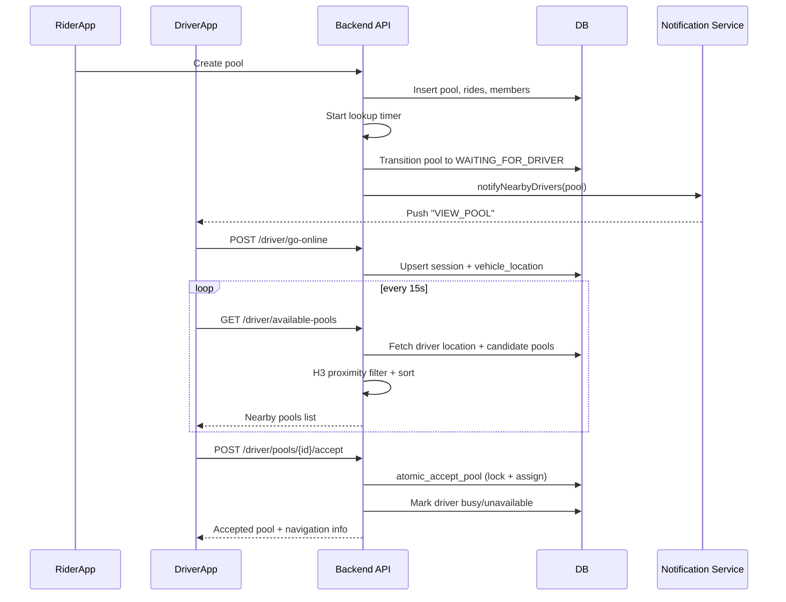

# Driver Pool Discovery And Acceptance Flow

This document explains how drivers find nearby pools, how data moves through the system, and what happens when a driver accepts a pool.

## Scope
- Rider creates a pool.
- Pool becomes visible to drivers.
- Driver app fetches nearby pools.
- Driver accepts a pool.
- System transitions to active ride state.

## Main Components
- Rider app: creates pool.
- Driver app: goes online, sends location, fetches and accepts pools.
- Backend: applies matching/filtering and transactional updates.
- Database: stores sessions, locations, pools, members, rides.
- Notification service: pushes new pool alerts to eligible drivers.

## Key API Endpoints
- `POST /driver/go-online`
- `PUT /driver/location`
- `GET /driver/available-pools`
- `POST /driver/pools/:poolId/accept`
- `GET /driver/active-pool`
- `POST /driver/go-offline`

Routes are defined in `Server/src/routes/driver.routes.ts`.

## Data Model Used In Driver Discovery
- `driver_sessions`: online/offline/busy state of driver.
- `vehicle_locations`: latest driver GPS and H3 indexes.
- `vehicles`: vehicle type matching (`CAR`, `CNG`).
- `pools`: pool status, driver assignment, pickup/destination.
- `pool_members`: pool membership records.
- `rides`: each member ride pickup/dropoff details.

## End-to-End Step By Step

### 1. Rider creates a pool
1. Rider creates pool (`/pools/create`).
2. Pool and creator ride are inserted.
3. Lookup timer starts (two-phase rider search).
4. Pool remains in rider-search phase first.

Relevant code:
- `Server/src/controllers/pool.controller.ts` (pool create flow)
- `Server/src/services/lookupTime.service.ts` (`startLookupTimer`)

### 2. Pool becomes driver-eligible
1. When enough riders are present, backend transitions pool to `WAITING_FOR_DRIVER`.
2. Rides are updated to confirmed state.
3. Backend can pre-calculate and cache combined route.
4. Backend triggers nearby driver notifications.

Relevant code:
- `Server/src/services/lookupTime.service.ts` (`transitionToWaitingForDriver`)
- `Server/src/services/notification.service.ts` (`notifyNearbyDrivers`)

### 3. Driver goes online
1. Driver app sends current location to `POST /driver/go-online`.
2. Backend verifies driver + active vehicle.
3. Backend creates/updates:
  - `driver_sessions` to `ONLINE`
  - `vehicle_locations` with lat/lng + H3 res8/res9

Relevant code:
- App call: `Client/DriverApp/src/services/driver.service.ts`
- Backend: `Server/src/controllers/driver.controller.ts` (`goOnline`)

### 4. Driver location keeps updating
1. Driver app watches GPS and sends periodic updates to `PUT /driver/location`.
2. Backend updates location via RPC and refreshes H3 indexes.
3. If driver is on an active pool, backend checks off-route drift and may recalculate route.

Relevant code:
- App watch loop: `Client/DriverApp/app/(tabs)/home.tsx`
- Backend: `Server/src/controllers/driver.controller.ts` (`updateLocation`)

### 5. Driver discovers available pools (pull model)
1. Driver app polls `GET /driver/available-pools` every 15 seconds.
2. Backend fetches driver's active location.
3. Backend computes driver pickup search area using H3:
  - Driver point -> H3 res9
  - H3 ring using configured pickup radius
4. Backend fetches candidate pools:
  - `status = WAITING_FOR_DRIVER`
  - `driver_id IS NULL`
  - `current_passengers >= 2`
  - optional `vehicle_type` match to driver vehicle
5. Backend filters each pool by pickup proximity:
  - pool creator pickup H3 in driver ring OR
  - any active member ride pickup H3 in driver ring
6. Backend builds response:
  - passengers with pickup/dropoff
  - nearest pickup distance
  - estimated arrival minutes
  - estimated total earnings
7. Backend sorts by nearest pickup and returns top pools.

Relevant code:
- App polling: `Client/DriverApp/app/(tabs)/home.tsx`
- App request: `Client/DriverApp/src/services/driver.service.ts`
- Backend logic: `Server/src/controllers/driver.controller.ts` (`getAvailablePools`)
- H3 utility: `Server/src/utils/h3.utils.ts`

### 6. Driver discovers pools (push model)
1. Backend also sends push notifications for new eligible pools to nearby available drivers.
2. Driver app receives push (`action=VIEW_POOL`).
3. App opens incoming pool alert and triggers immediate refresh of available pools.

Relevant code:
- Backend push targeting: `Server/src/services/notification.service.ts` (`notifyNearbyDrivers`)
- Driver push handling: `Client/DriverApp/app/(tabs)/home.tsx`
- Alert UI: `Client/DriverApp/src/components/pool/PoolRequestAlert.native.tsx`

### 7. Driver accepts a pool
1. Driver taps accept in UI.
2. App calls `POST /driver/pools/:poolId/accept`.
3. Backend validates:
  - driver has no other active pool
  - driver is online
  - driver vehicle type matches pool
4. Backend performs atomic assignment via RPC (`atomic_accept_pool`) with row lock semantics.
5. Backend updates:
  - `driver_sessions` -> `BUSY`
  - `vehicle_locations` -> `is_available=false`, attach `pool_id`
6. Backend clears cached route so route is recalculated with driver start position.
7. Backend returns accepted pool details + nearest pickup + navigation URL.
8. Driver app sets active pool and can open Google Maps navigation.

Relevant code:
- App accept call: `Client/DriverApp/src/services/driver.service.ts`
- App accept handler: `Client/DriverApp/app/(tabs)/home.tsx`
- Backend accept flow: `Server/src/controllers/driver.controller.ts` (`acceptPool`)
- DB atomic RPC: `Server/supabase/migrations/20260121_ridepool_merged_schema.sql` (`atomic_accept_pool`)

## How "Nearby" Is Computed
- Nearby is H3 cell proximity, not raw SQL geodistance scan.
- Driver-side search uses H3 resolution 9 around current driver location.
- Pool qualifies if any relevant pickup H3 cell falls inside the driver's H3 ring.
- This is a fast pre-filter and then app receives concrete lat/lng distances for display.

## What Driver UI Shows
- Map markers for pool pickup points.
- Pool cards with:
  - passenger count
  - nearest pickup km
  - ETA minutes
  - estimated earnings
- Accept action per pool.

Relevant UI:
- `Client/DriverApp/src/components/map/MapView.native.tsx`
- `Client/DriverApp/src/components/pool/PoolCard.native.tsx`
- `Client/DriverApp/src/components/home/HomeScreen.native.tsx`

## Sequence Diagram

## Notes
- Discovery is hybrid: push for immediacy, poll for consistency.
- Acceptance is protected by atomic DB function to prevent race conditions.
- Driver proximity filtering is optimized with H3 indexing before detailed distance display.
