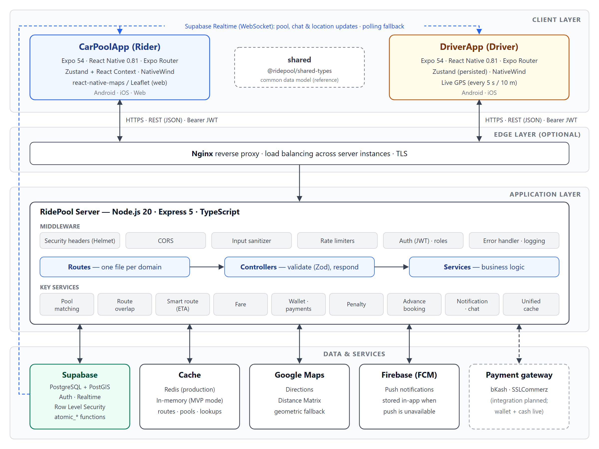
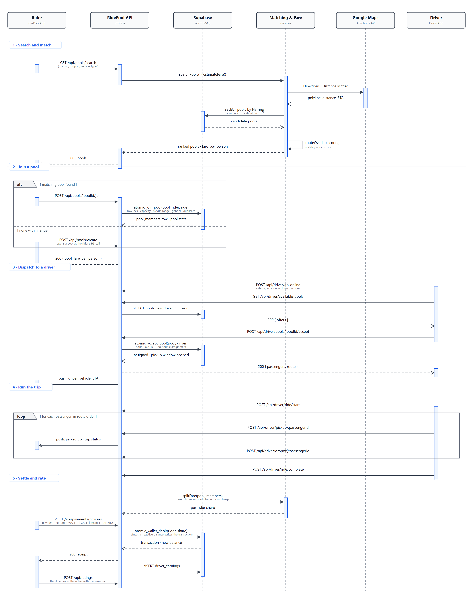
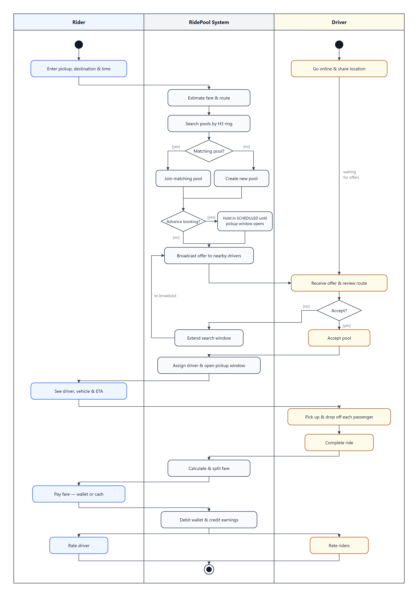
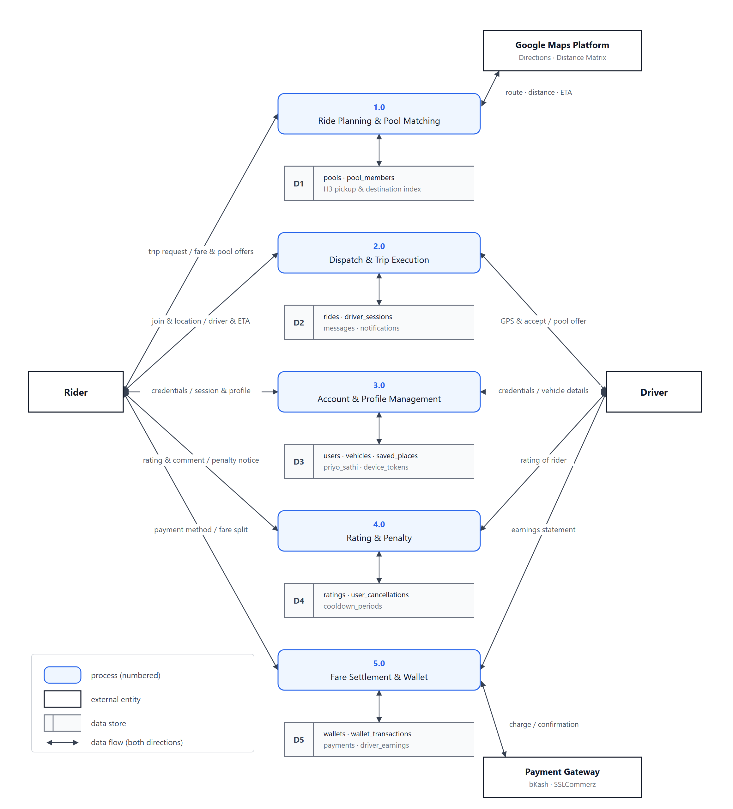
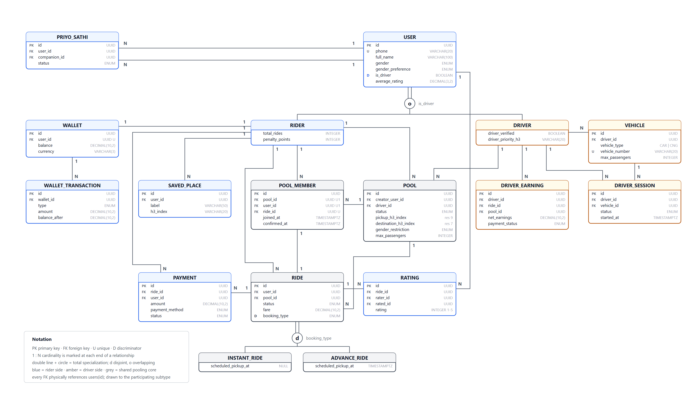
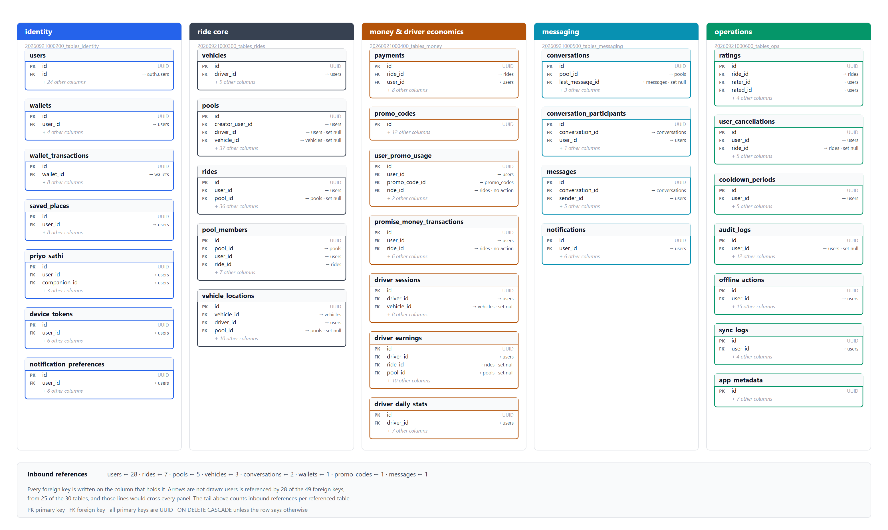
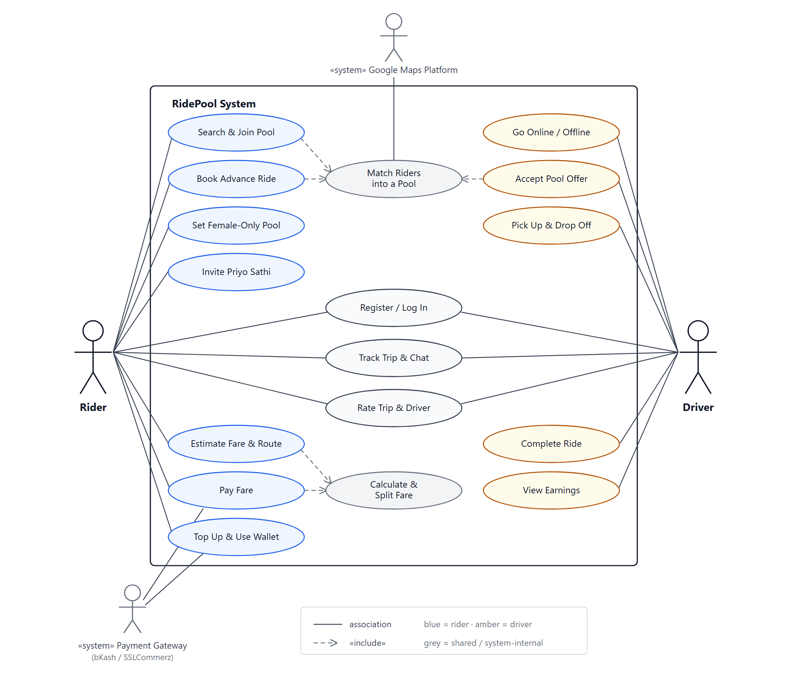

# Chapter 4

# Project Analysis

This chapter analyses how RidePool is built and how it works. It explains the system architecture, how the parts of the apps work together, how data moves through the system (with the project's UML and database diagrams), the user interface, and how the system was evaluated and tested.

## 4.1 System Architecture

RidePool follows a **client–server architecture** with four layers, shown in Figure 4.1:

1. **Client layer** – two mobile apps, CarPoolApp for riders and DriverApp for drivers, built with React Native and Expo. A separate `shared` package describes the common data model (rides, pools, users, payments).
2. **Edge layer (optional)** – an Nginx reverse proxy that spreads requests across server instances in production. In MVP mode the apps talk to a single server directly.
3. **Application layer** – the RidePool server, built with Node.js, Express and TypeScript. Each request passes through security middleware, then through **Routes → Controllers → Services**.
4. **Data and external services layer** – Supabase (PostgreSQL database, authentication and real-time updates), a cache (Redis or in-memory), Google Maps for routes, Firebase Cloud Messaging for push notifications, and a payment gateway (planned).

*Figure 4.1: RidePool system architecture*

The apps send normal requests (search, join, pay) to the server over HTTPS as REST calls with a JSON Web Token (JWT). Live changes — a new passenger joining, the driver's location, new chat messages — are pushed to the apps directly by **Supabase Realtime**, with regular polling as a backup.

**Table 4.1: Responsibilities of each layer**

| Layer | Main parts | Responsibility |
|-------|-----------|----------------|
| Client | CarPoolApp, DriverApp, shared types | Show screens, collect input, show maps, keep session and trip state |
| Edge | Nginx | Forward requests, balance load, handle TLS (production only) |
| Application | Middleware, routes, controllers, services | Check security, validate input, run business logic (matching, fares, wallet, penalties) |
| Data | Supabase PostgreSQL, Auth, Realtime | Store data, log users in, run atomic functions, push live updates |
| External | Cache, Google Maps, FCM, payment gateway | Speed up responses, calculate routes, send push notifications, take payments |

### 4.1.1 Sequence Diagram

A sequence diagram shows **which part of the system talks to which, and in what order**. Figure 4.2 shows the complete life of a shared ride across the six main participants of the architecture: the **Rider** (CarPoolApp), the **RidePool API** (Express server), **Supabase** (PostgreSQL), the **Matching & Fare** services, **Google Maps**, and the **Driver** (DriverApp).

*Figure 4.2: Sequence diagram of a complete shared ride*

From the architecture point of view, the diagram shows three important facts:

- **The apps never talk to the database directly for actions.** Every action (search, join, accept, pay) goes to the RidePool API first, which checks it and then calls the database.
- **Critical steps are done inside the database.** Joining a pool (`atomic_join_pool`), accepting a pool (`atomic_accept_pool`) and paying from the wallet (`atomic_wallet_debit`) run as single atomic functions in PostgreSQL, so two users can never take the same seat or the same pool.
- **During matching, Google Maps is called only by the server's matching services**, and only once per search, which keeps the map cost low.

The five phases of the diagram (search, join, dispatch, trip, settle) are explained step by step in Section 4.3.5.

### 4.1.2 Modularity and Scalability

**Modularity.** RidePool is split into small parts that each do one job:

**Table 4.2: Modules of the system**

| Module | What it contains | Why it is separate |
|--------|------------------|--------------------|
| `Server` | Express API, services, database migrations | Business logic stays in one place for both apps |
| `Client/CarPoolApp` | Rider screens, components, hooks, services | Rider features can change without touching the driver app |
| `Client/DriverApp` | Driver screens, components, store, services | Driver features and GPS logic are kept apart |
| `shared` | TypeScript types for rides, pools, users, payments | One written reference for the data model |

Inside the server, each feature (pools, rides, drivers, payments, wallet, ratings, messaging, advance booking, Priyo Sathi, promo codes) has its own **route file, controller and service**. A new feature can be added as a new set of files without changing the others. Inside the apps, each feature has its own **service file** (for example `pool.service.ts`, `payment.service.ts`) that calls the server.

**Scalability.** The system is designed to grow step by step:

- **Stateless API:** The server keeps no user session in memory; every request carries its own JWT. Any server instance can answer any request, so more instances can be added behind Nginx.
- **Two cache modes:** In MVP mode the cache is kept in memory (no Redis needed). In production a shared **Redis** cache is used so all instances see the same cached routes and pools.
- **Cheap matching:** The H3 hexagon grid [2] turns "find nearby pools" into a quick lookup of hexagon IDs, so matching stays fast as the number of pools grows.
- **Database does the locking:** Because seat and money operations are atomic database functions, adding more server instances does not create race conditions.
- **Configurable settings:** Search radius, H3 resolutions, advance-booking time windows and cache mode are all set through environment variables, so they can be tuned without changing code.

### 4.1.3 Challenges and Considerations

**Table 4.3: Design challenges and how they were handled**

| Challenge | Consideration | Design decision |
|-----------|---------------|-----------------|
| Many riders joining the last seat at once | A car must never be overfilled | `atomic_join_pool` locks the pool row and checks capacity, pickup range, gender and duplicates in one step |
| Several drivers accepting the same pool | A pool must get exactly one driver | `atomic_accept_pool` uses `SKIP LOCKED` so only the first driver wins |
| Google Maps cost | Each call costs money | Only the top 10 matches are enriched; one route call per search is shared; results are cached; a geometric fallback is used if Maps fails |
| Fast matching across the city | Comparing every rider with every pool is slow | H3 indexing: pickup at resolution 9 (~0.35 km), destination at resolution 7 (~2.4 km), driver at resolution 8 |
| Live updates on mobile networks | Connections drop often in Dhaka | Supabase Realtime plus polling fallback (every 3 s when disconnected) |
| Trusting data from the phone | A modified app could send false data | Vehicle capacity and gender are always read from the server, never from the client |
| Scheduled rides | Must not break instant rides | An advance booking is a normal `rides` row with `booking_type = 'ADVANCE'`; scheduled pools stay hidden until their pickup window opens |
| Security | Login and payment endpoints attract abuse | Rate limiters, input sanitization, Helmet security headers, JWT authentication and Row Level Security |

## 4.2 App Module Integration

RidePool is not one program but several modules — two mobile apps, a server, a database and outside services — that must work together as one system. This section explains how the main modules are connected: through the API, through the shared pool lifecycle, through real-time updates, through maps and routing, through the wallet and payments, and through session and offline handling.

### 4.2.1 Client–Server API Integration

The two apps talk to the server only through a **REST API** under the `/api` path. The API is divided into **16 modules** with about **114 endpoints**. Each module has its own route file, controller and service on the server, and a matching service file in the apps (for example `pool.service.ts` in CarPoolApp calls `/api/pools`).

**Table 4.4: API modules of the RidePool server**

| Module (path) | Endpoints | Main purpose | Used by |
|---------------|-----------|--------------|---------|
| `/api/auth` | 8 | Register, log in, reset and change password | Both apps |
| `/api/users` | 11 | Profile, gender preference, device tokens, notifications, account deletion | Both apps |
| `/api/pools` | 15 | Search, create, join and leave pools | Rider app |
| `/api/advance-bookings` | 5 | Book, edit, cancel and confirm scheduled rides | Rider app |
| `/api/rides` | 4 | Fare estimate, ride request, history, cancellation | Rider app |
| `/api/driver` | 17 | Go online, available pools, accept, pickup, drop-off, complete, earnings | Driver app |
| `/api/payments` | 2 | Process a payment, payment history | Rider app |
| `/api/wallet` | 7 | Balance, top-up, pay, withdraw, transactions | Both apps |
| `/api/priyo-sathi` | 10 | Trusted companions, requests and ride invites | Rider app |
| `/api/ratings` | 5 | Rate riders and drivers | Both apps |
| `/api/messages` | 8 | In-pool chat conversations | Both apps |
| `/api/promos` | 5 | Validate and apply promo codes | Rider app |
| `/api/saved-places` | 5 | Home, office and other saved places | Rider app |
| `/api/offline` | 6 | Offline data package, sync and conflict resolution | Both apps |
| `/api/analytics` | 5 | Usage and search statistics | Admin / monitoring |
| `/api/navigation` | 1 | Google Maps deep link for turn-by-turn navigation | Driver app |

Every request follows the same rules, which makes the modules easy to connect:

- **Authentication:** Private endpoints need a `Bearer` JWT in the request header. The `authenticate` middleware checks it with Supabase Auth.
- **Validation:** Controllers check the request body with **Zod** schemas before any work is done.
- **Same response format:** Every response has the same shape, so the apps can handle all of them in one way:
  - Success: `{ success: true, data, message, timestamp }`
  - Error: `{ success: false, error: { code, message, details }, timestamp }`
- **Rate limits by module:** Stricter limits are applied to login, pool search and payment/wallet routes (Chapter 3, Table 3.4).
- **Common data model:** The server and both apps use the same field names and status values, which are also written down in the `shared` package (`@ridepool/shared-types`) as a reference.

### 4.2.2 Pool Lifecycle across Rider and Driver Apps

The **pool** is the object that joins the rider app and the driver app together. Both apps watch the same pool and react when its status changes. The same status values are used by the server, both apps and the database.

**Table 4.5: Pool status lifecycle**

| Status | Meaning | Changed by |
|--------|---------|------------|
| `SCHEDULED` | An advance pool is collecting bookings; it is hidden from instant riders | Advance booking service when a scheduled ride is assigned |
| `WAITING_FOR_RIDERS` | A new instant pool is open for other riders to join | Rider app creates a pool (`POST /api/pools/create`) |
| `WAITING_FOR_DRIVER` | The pool has enough riders (at least 2) and is shown to drivers | Search timer (at least 2 riders), `atomic_join_pool` when the pool becomes full, or advance dispatch after riders confirm |
| `READY_TO_START` | A driver has accepted and is going to the pickups | `atomic_accept_pool` when the driver accepts |
| `STARTED` | The trip is in progress | Driver app starts the ride |
| `COMPLETED` | All passengers are dropped off and the fare is settled | Driver app completes the ride |
| `CANCELLED` | Not enough riders joined in time, or the pool was cancelled | Search timer, advance scheduler, or rider/driver cancellation |

Two background timers keep this lifecycle moving without any user action:

- **Search timer (instant pools):** A new pool gets a **30-second** search window, plus a **10-second** extension if it is still short of riders (40 seconds in total). If at least two riders have joined, the pool moves to `WAITING_FOR_DRIVER`; if not, it is cancelled and the rider is told.
- **Advance scheduler (scheduled pools):** Every **15 seconds** the scheduler checks scheduled pools. It opens the confirmation window before pickup, removes riders who did not confirm, and sends the pool to drivers once **two riders have confirmed**. A pool is never sent out as a solo ride unless solo fallback is switched on.

If a driver cancels after accepting, the pool goes back to `WAITING_FOR_DRIVER` so another driver can take it.

### 4.2.3 Real-Time Updates and Notifications

When the pool changes in one app, the other app must see the change at once. RidePool uses three channels for this:

1. **Supabase Realtime** (WebSocket) sends database changes directly to the apps through the hooks `usePoolRealtime`, `useDriverLocationRealtime` and `useChatRealtime`.
2. **Polling fallback** asks the server for updates at a fixed interval when the realtime connection is lost, which happens often on mobile networks.
3. **Notifications** are saved in the `notifications` table and, when configured, also sent as push notifications through Firebase Cloud Messaging (FCM). A failed push never stops the main action.

**Table 4.6: Live update channels**

| Data | Main channel | Backup |
|------|--------------|--------|
| Pool status and passengers | Supabase Realtime | Polling every 3 s if disconnected; 30 s check while connected |
| Driver location | Supabase Realtime | Driver app sends GPS every 5 s or 10 m of movement |
| Chat messages | Supabase Realtime | Polling every 2 s |

**Table 4.7: Main notification types**

| Type | When it is sent |
|------|-----------------|
| `POOL_MATCH` | A rider joins or a pool is matched |
| `POOL_REQUEST` | A pool is offered to a driver |
| `DRIVER_ASSIGNED` / `DRIVER_UNASSIGNED` | A driver accepts or leaves the pool |
| `RIDE_STARTED` / `RIDE_COMPLETED` | The driver starts or completes the trip |
| `POOL_MEMBER_LEFT` / `POOL_CANCELLED` | A rider leaves or the pool is cancelled |
| `PAYMENT_RECEIVED` | A payment is recorded |
| `RATING_REQUEST` | The trip has ended and ratings are requested |
| `MESSAGE` | A new chat message arrives |

### 4.2.4 Maps, Routing and Navigation Integration

Location is at the centre of RidePool, and several location components work together:

**Table 4.8: Location and routing components**

| Component | Where | Job |
|-----------|-------|-----|
| **H3 hexagon grid** (`h3-js`) | Server (`h3.utils.ts`) | Turns every pickup (resolution 9), destination (resolution 7) and driver (resolution 8) into a hexagon ID for fast nearby search |
| **Route overlap** | Server (`routeOverlap.service.ts`) | Measures how much two riders' routes share, so riders going the same way are matched |
| **Smart route** | Server (`smartRoute.service.ts`) | Finds the fastest pickup and drop-off order for all passengers, respecting each passenger's detour limit |
| **Google Maps Platform** | Server (`googleMaps.service.ts`) | Provides road routes, distances, traffic-aware travel times and route geometry |
| **Navigation deep link** | Server → Driver app | Opens Google Maps turn-by-turn navigation for the driver's next stop |
| **Map display** | Both apps | `react-native-maps` on phones, Leaflet on the web, a static map as a last fallback |

To keep cost low and the system reliable:

- Route calculation for **matching, fares and pickup order is done only by the server**, which keeps the main map cost under control. The rider app calls Google Maps directly only for place search, address lookup and drawing the route line on its own map.
- The rider's route is fetched **once per search** and shared by all matches, and only the **top 10** matches are enriched.
- Routes are **cached**, and identical requests that arrive at the same time are merged into one call.
- If Google Maps fails, the server uses a **simple geometric estimate** and does not pretend it has live traffic data.

### 4.2.5 Wallet, Payment and Promo Integration

Money moves through several modules, and it must never be lost or counted twice:

1. **Fare module** (`fare.service.ts`) calculates the fare per person after the pool discount and adds the Tk 10 platform fee.
2. **Promo module** (`promo.service.ts`) applies a percentage or fixed discount, never more than the promo's maximum amount.
3. **Payment module** (`/api/payments/process`) records the payment. The rider chooses **wallet** or **cash**; mobile banking (bKash / SSLCommerz) is planned.
4. **Wallet module** (`/api/wallet`) handles balance, top-up and payment. Every debit goes through the **`atomic_wallet_debit`** database function, which refuses a negative balance and writes a transaction record in the same step.
5. **Driver earnings** are recorded in `driver_earnings` when the pool is completed, with the platform keeping a 20% commission.

Because steps 4 and 5 are done inside the database, a payment cannot be half-finished: either the wallet is debited *and* the transaction is recorded, or nothing happens.

### 4.2.6 Session, Trip and Offline State

The apps must keep working when they are closed, moved to the background or offline.

- **Login session:** In CarPoolApp, `AuthContext` saves the JWT and a copy of the user profile on the phone (AsyncStorage). When the app opens, the saved profile is shown at once and then refreshed from the server. The user is logged out **only** when the server says the token is invalid, not on a network error. In DriverApp, the Zustand store saves only the user, vehicle and login flag; fast-changing data is always loaded fresh.
- **Search choices across screens:** `GlobalContext` holds the pickup, destination, ride type (regular or female-only) and selected pool, so every booking screen reads the same values and the rider never enters them twice.
- **Active trip after a restart:** The active trip is saved on the phone. When the app reopens, it is checked with the server: if the pool is still active the trip screen is restored with fresh data; if it was completed or cancelled the saved trip is deleted.
- **Offline actions:** The `/api/offline` module gives the app a data package to use offline and later **syncs** actions made while offline, keeping them in their original order.

**Table 4.9: State kept on the phone**

| State | App | Stored in | Restored how |
|-------|-----|-----------|--------------|
| JWT and user profile | CarPoolApp | AsyncStorage | Shown at once, then refreshed from the server |
| User, vehicle, login flag | DriverApp | Zustand persisted store | Loaded on start |
| Search choices | CarPoolApp | `GlobalContext` (memory) | Shared by all booking screens |
| Active trip | CarPoolApp | AsyncStorage | Checked with the server on start |
| Offline actions | Both apps | Offline queue | Synced through `/api/offline/sync` |

## 4.3 Data Flow and Process Overview

This section describes the processes and data of RidePool using six diagrams. Table 4.10 gives a short guide.

**Table 4.10: Diagrams in this chapter**

| Diagram | Type | What it shows | Figure |
|---------|------|---------------|--------|
| Activity diagram | UML behaviour | The steps of a ride from request to rating, split by rider, system and driver | 4.3 |
| Data flow diagram | Structured analysis | Main processes, data stores and how data moves between them | 4.4 |
| EER diagram | Conceptual data model | Entities, attributes, relationships and specialisations | 4.5 |
| Schema diagram | Physical data model | All 30 database tables with their keys | 4.6 |
| Sequence diagram | UML interaction | Messages between apps, server, database and services over time | 4.2 |
| Use case diagram | UML requirements | What riders and drivers can do with the system | 4.7 |

### 4.3.1 Activity Diagram

*Figure 4.3: Activity diagram of a shared ride*

Figure 4.3 is a swim-lane activity diagram with three lanes: **Rider**, **RidePool System** and **Driver**. It shows the full flow of one shared ride:

1. **Request.** The rider enters pickup, destination and (for advance booking) time. The system estimates the fare and route, then searches for pools using the H3 hexagon ring.
2. **Match.** If a matching pool exists, the rider **joins** it; if not, the system **creates a new pool**.
3. **Scheduling check.** If it is an advance booking, the pool is held in the `SCHEDULED` state until its pickup window opens.
4. **Dispatch.** The system broadcasts the pool to nearby online drivers. A driver reviews the route and accepts. If no driver accepts, the system **extends the search window and re-broadcasts**.
5. **Trip.** After a driver accepts, the system assigns the driver and opens the pickup window. The rider sees the driver, vehicle and ETA, and the driver picks up and drops off each passenger, then completes the ride.
6. **Settlement.** The system calculates and splits the fare. The rider pays by wallet or cash, the wallet is debited and the driver's earnings are credited.
7. **Rating.** The rider rates the driver and the driver rates the riders, and the flow ends.

The driver lane runs in parallel from the start: the driver goes online, shares their location and waits for offers.

### 4.3.2 Data Flow Diagram

*Figure 4.4: Level-1 data flow diagram*

Figure 4.4 is a level-1 data flow diagram (DFD). It has two main **external entities** (Rider and Driver), two **external systems** (Google Maps Platform and the payment gateway), five **processes** and five **data stores**:

**Table 4.11: Processes and data stores in the DFD**

| Process | Main input | Main output | Data store used |
|---------|-----------|-------------|-----------------|
| 1.0 Ride Planning & Pool Matching | Trip request (rider); route, distance, ETA (Google Maps) | Fare and pool offers | D1: `pools`, `pool_members` (H3 index) |
| 2.0 Dispatch & Trip Execution | Join and location (rider); GPS and accept (driver) | Driver and ETA to rider; pool offer to driver | D2: `rides`, `driver_sessions`, `messages`, `notifications` |
| 3.0 Account & Profile Management | Credentials (rider and driver); vehicle details | Session and profile | D3: `users`, `vehicles`, `saved_places`, `priyo_sathi`, `device_tokens` |
| 4.0 Rating & Penalty | Ratings and comments; rating of rider | Penalty notice | D4: `ratings`, `user_cancellations`, `cooldown_periods` |
| 5.0 Fare Settlement & Wallet | Payment method; charge confirmation (gateway) | Fare split; earnings statement | D5: `wallets`, `wallet_transactions`, `payments`, `driver_earnings` |

The diagram makes clear that each process owns its own group of tables. This matches the modular design of the server, where each group of tables is handled by its own services.

### 4.3.3 EER Diagram

*Figure 4.5: Enhanced entity–relationship (EER) diagram*

Figure 4.5 is the enhanced entity–relationship (EER) diagram. It shows the main entities and how they are related. Colours group the entities: **blue** for the rider side, **amber** for the driver side and **grey** for the shared pooling core.

Key points of the model:

- **USER** is the central entity. It is **specialised** into **RIDER** and **DRIVER** using the `is_driver` attribute. The specialisation is *overlapping* (`o`), because one person can be both a rider and a driver.
- **RIDE** is specialised into **INSTANT_RIDE** and **ADVANCE_RIDE** using `booking_type`. This specialisation is *disjoint* (`d`): a ride is either instant or advance. Only an advance ride has a `scheduled_pickup_at` time.
- A **POOL** has many **POOL_MEMBER** rows, and each member links one rider and one ride to that pool. A pool stores its pickup H3 index (resolution 9), destination H3 index (resolution 7), gender restriction and maximum passengers.
- A **DRIVER** owns **VEHICLE**s (CAR or CNG), opens **DRIVER_SESSION**s when online, and receives **DRIVER_EARNING** records for completed pools.
- A **RIDER** has one **WALLET** with many **WALLET_TRANSACTION**s, many **PAYMENT**s, **SAVED_PLACE**s and **PRIYO_SATHI** companion links.
- **RATING** connects a ride with the person who rates (`rater_id`) and the person rated (`rated_id`), with a score from 1 to 5.

**Table 4.12: Main relationships**

| Relationship | Cardinality | Meaning |
|-------------|-------------|---------|
| USER – WALLET | 1 : 1 | Each user has one wallet |
| WALLET – WALLET_TRANSACTION | 1 : N | Every balance change is recorded |
| POOL – POOL_MEMBER | 1 : N | A pool has up to 3 (CAR) or 2 (CNG) members |
| RIDE – POOL_MEMBER | 1 : 1 | Each ride appears in a pool at most once |
| DRIVER – VEHICLE | 1 : N | A driver may register more than one vehicle |
| DRIVER – POOL | 1 : N | A driver serves many pools over time, one at a time |
| RIDE – PAYMENT | 1 : N | A ride can have one or more payment records |
| USER – PRIYO_SATHI | 1 : N | A user can add up to 5 trusted companions |

### 4.3.4 Schema Diagram

*Figure 4.6: Relational schema diagram (30 tables)*

Figure 4.6 is the physical relational schema of the Supabase PostgreSQL database. It shows **all 30 tables** with their primary keys (PK) and foreign keys (FK). All primary keys are UUIDs, and a foreign key deletes its child rows (`ON DELETE CASCADE`) unless the diagram says otherwise (for example `set null`).

The tables are grouped by the migration file that creates them:

**Table 4.13: Table groups in the schema**

| Group | Tables | Purpose |
|-------|--------|---------|
| Identity | `users`, `wallets`, `wallet_transactions`, `saved_places`, `priyo_sathi`, `device_tokens`, `notification_preferences` | Users, their money and personal settings |
| Ride core | `vehicles`, `pools`, `rides`, `pool_members`, `vehicle_locations` | Pooling, rides and live vehicle positions |
| Money & driver economics | `payments`, `promo_codes`, `user_promo_usage`, `promise_money_transactions`, `driver_sessions`, `driver_earnings`, `driver_daily_stats` | Payments, promotions and driver income |
| Messaging | `conversations`, `conversation_participants`, `messages`, `notifications` | In-app chat and notifications |
| Operations | `ratings`, `user_cancellations`, `cooldown_periods`, `audit_logs`, `offline_actions`, `sync_logs`, `app_metadata` | Ratings, penalties, auditing and offline sync |

The `users` table is the most referenced: **28 of the 49 foreign keys** point to it, from 25 of the 30 tables. `rides` (7 references) and `pools` (5 references) come next. For this reason arrows are not drawn in the figure; each foreign key is written on the column that holds it instead.

### 4.3.5 Sequence Diagram

The sequence diagram in Figure 4.2 (Section 4.1.1) divides a shared ride into five phases. Each phase uses specific API endpoints and database functions:

**Table 4.14: Phases of the sequence diagram**

| Phase | Main messages | What happens |
|-------|---------------|--------------|
| 1. Search and match | `GET /api/pools/search` → `searchPools()` → Google Maps Directions → `SELECT pools by H3 ring` → route-overlap scoring | The server finds nearby pools, scores them and returns a ranked list with the fare per person |
| 2. Join a pool | `POST /api/pools/:poolId/join` → `atomic_join_pool` (or `POST /api/pools/create` if no pool is in range) | The rider is added to the pool with a row lock that checks capacity, pickup range, gender and duplicates |
| 3. Dispatch to a driver | `POST /api/driver/go-online` → `GET /api/driver/available-pools` → `POST /api/driver/pools/:poolId/accept` → `atomic_accept_pool` | The driver sees nearby pools (H3 resolution 8) and accepts one; `SKIP LOCKED` prevents double assignment; the rider gets a push with driver, vehicle and ETA |
| 4. Run the trip | `POST /api/driver/ride/start` → loop of `pickup/:passengerId` and `dropoff/:passengerId` → `ride/complete` | The driver picks up and drops off each passenger in route order; riders get status pushes |
| 5. Settle and rate | `splitFare()` → `POST /api/payments/process` → `atomic_wallet_debit` → `INSERT driver_earnings` → `POST /api/ratings` | The fare is split, the wallet is debited safely, the driver's earnings are recorded and both sides rate each other |

The diagram also uses two UML frames: an **alt** frame (join an existing pool *or* create a new one) and a **loop** frame (repeat pickup and drop-off for each passenger).

### 4.3.6 Use Case Diagram

*Figure 4.7: Use case diagram*

Figure 4.7 shows what each actor can do with RidePool. There are two **primary actors** — **Rider** and **Driver** — and two **external system actors** — **Google Maps Platform** and the **Payment Gateway** (bKash / SSLCommerz).

**Table 4.15: Use cases by actor**

| Actor | Use cases |
|-------|-----------|
| Rider | Search & Join Pool, Book Advance Ride, Set Female-Only Pool, Invite Priyo Sathi, Estimate Fare & Route, Pay Fare, Top Up & Use Wallet |
| Driver | Go Online / Offline, Accept Pool Offer, Pick Up & Drop Off, Complete Ride, View Earnings |
| Both | Register / Log In, Track Trip & Chat, Rate Trip & Driver |
| System (internal) | Match Riders into a Pool, Calculate & Split Fare |

The dashed `«include»` arrows show shared behaviour: *Search & Join Pool*, *Book Advance Ride* and *Accept Pool Offer* all include **Match Riders into a Pool**, and *Estimate Fare & Route* and *Pay Fare* both include **Calculate & Split Fare**. Google Maps supports the matching use case, and the payment gateway supports paying and wallet top-up.

## 4.4 User Interaction and Interface

### 4.4.1 Design Principles

The interface of both apps follows a few simple principles:

- **Map first:** Most screens are built around a map, because riders and drivers think in terms of places and routes.
- **Few steps:** A rider can book a ride in a few taps — choose a destination, pick a pool, confirm.
- **Clear information before commitment:** Fare, pickup distance, number of passengers and estimated time are shown *before* the rider joins a pool.
- **Consistent colours:** Blue marks rider actions, amber marks driver actions, and a rose/pink colour marks female-only options, matching the diagrams.
- **Same design on every platform:** NativeWind (Tailwind CSS) styles are shared, so the apps look the same on Android, iOS and web.

### 4.4.2 Rider App (CarPoolApp) Screens

**Table 4.16: Main screens of the rider app**

| Screen | Purpose |
|--------|---------|
| Welcome / Login / Profile setup | Sign in or register and fill in name, phone and gender |
| Home map | Shows the rider's location; starting point for every search |
| Location and destination search | Search for places or pick a saved place |
| Available pools | List of matching pools with fare, pickup distance, passengers and ETA |
| Create ride | Start a new pool and choose CAR or CNG when no pool fits |
| Ride confirmation | Final check of pickup, destination, pool and fare before joining |
| Searching / driver matched | Waiting screen while a driver is found, then driver, vehicle and ETA |
| Trip progress | Live map with the driver's position and trip status |
| Chat | Chat with co-riders and the driver |
| Payment summary / rating | Fare breakdown, payment, then rating the driver and co-riders |
| Scheduled rides | Book and manage advance rides |
| Wallet / add money / transactions | Balance, top-up and history |
| Friends (Priyo Sathi) | Add trusted companions and invite them to rides |
| Saved places, gender preference, promo code | Personal settings used during booking |
| Notifications, trips, ratings, help & support, settings | History, feedback and support |

### 4.4.3 Driver App (DriverApp) Screens

**Table 4.17: Main screens of the driver app**

| Screen | Purpose |
|--------|---------|
| Login / Register | Sign in or register with vehicle details |
| Home map | Go online or offline, see the current location and nearby demand |
| Pool request alert / pool card | New pool offers with passengers, route and fare |
| Pool details sheet | Full details of a pool before accepting |
| Active ride / trip progress | Navigate to each pickup and drop-off and update the trip |
| Passenger billing dialog | Fare to collect from each passenger at drop-off |
| Rating feedback dialog | Rate riders after the trip |
| Earnings | Today's earnings, number of rides and history |
| Search zone / priority location | Choose where to look for pools |
| Profile, settings, contact info, help | Account and support |

### 4.4.4 Navigation Structure

Both apps use **Expo Router**, where each file in the `app/` folder becomes a screen. The main areas are reached through a **bottom navigation bar**, and detail screens (such as ride confirmation or trip progress) open on top of them as a stack. This makes the back button behave as users expect on both Android and iOS. The typical rider journey is:

**Home → Destination search → Available pools → Ride confirmation → Searching → Driver matched → Trip progress → Payment summary → Rating**

### 4.4.5 Feedback and Notifications

Users always know what is happening:

- **Live status:** Trip screens update in real time as the driver moves or a passenger is picked up.
- **Push and in-app notifications:** Important events (pool found, driver assigned, driver arriving, trip completed, penalty or cooldown) are sent as push notifications and also stored in the Notifications screen, so nothing is lost if a push fails.
- **Clear errors:** If an action fails (for example, the pool became full), the server returns a clear message that the app shows to the user.
- **Resume where you left off:** An active trip is restored automatically when the app is reopened (Section 4.2.6).

### 4.4.6 Cross-Platform Maps

Maps work differently on each platform, so RidePool chooses the map component at run time:

- On **Android and iOS**, maps use `react-native-maps` (Google Maps).
- On the **web**, maps use **Leaflet** with `react-leaflet` (the `WebMap` component).
- If the native map library is not available (for example, in the Expo Go test app), a **static map image** is shown instead, so the screen still works.

All three are hidden behind one `MapView` component, so the rest of the app does not need to know which map is in use.

## 4.5 Evaluation and Testing

This section explains how RidePool was tested and what the results show. Testing focused on the parts where a mistake would hurt users most: matching, fares, seats, money, scheduled rides and input validation.

### 4.5.1 Testing Strategy

RidePool was tested at several levels, from single functions up to the whole ride flow on real devices.

**Table 4.18: Testing levels and tools**

| Level | Tool | What is tested | Where |
|-------|------|----------------|-------|
| Unit testing | Vitest 4 | Server services (matching, fares, penalties, advance booking, routing, cache, validation) with the database and Google Maps replaced by mocks | `Server/tests/unit/` (14 files) |
| Database integration testing | Vitest + Supabase | Connection, all core tables, atomic RPC functions and the PostGIS extension on the real database | `Server/tests/supabase-connection.test.ts` |
| Regression testing | Vitest | Bugs that were fixed stay fixed | `Server/tests/unit/bugfixes.test.ts` |
| Static checking | TypeScript (`tsc --noEmit`), ESLint | Type errors and code-style problems in the server and apps | All packages |
| Manual end-to-end testing | Expo on Android phones and web | Full ride flow with the rider app and driver app running together | Both apps |

Two features of the code make testing easier:

- **Mocks:** 8 of the unit-test files replace Supabase and outside services with mocks, so tests are fast, repeatable and do not change real data.
- **Fast QA mode for scheduled rides:** Setting `ADVANCE_TIME_UNIT=seconds` shrinks every advance-booking window from minutes to seconds, so the full scheduled-ride lifecycle (book → confirm → dispatch) can be tested in under a minute instead of waiting for real time to pass.

### 4.5.2 Unit Test Results

The server test suite has **15 test files with 173 tests**. All tests passed in about 8.7 seconds (Vitest, run on 23 September 2026), and the server type-check (`tsc --noEmit`) reported no errors.

**Table 4.19: Server test results**

| Test file | Area tested | Tests | Result |
|-----------|-------------|-------|--------|
| `advanceBooking.service.test.ts` | Advance booking windows, confirmation and pickup range | 19 | Passed |
| `smartRoute.service.test.ts` | Pickup order, detour limits, caching and fallback | 18 | Passed |
| `validation.test.ts` | Input validation schemas | 17 | Passed |
| `fare.service.test.ts` | Fare, discounts, surcharge and driver earnings | 16 | Passed |
| `poolMatching.service.test.ts` | Pool compatibility and scoring | 14 | Passed |
| `routeOverlap.service.test.ts` | Route similarity for 2 and 3+ riders | 13 | Passed |
| `advanceDispatch.service.test.ts` | Dispatching scheduled pools | 13 | Passed |
| `memoryCache.service.test.ts` | In-memory cache and expiry | 13 | Passed |
| `bugfixes.test.ts` | Regression tests for fixed bugs | 12 | Passed |
| `lookupTime.service.test.ts` | 30 + 10 second search timer | 8 | Passed |
| `cache.service.test.ts` | Cache keys and status | 8 | Passed |
| `supabase-connection.test.ts` | Database tables, atomic functions, PostGIS | 8 | Passed |
| `googleMaps.routes.test.ts` | Google Maps request and response handling | 7 | Passed |
| `penalty.service.test.ts` | Cancellation penalties and cooldown | 4 | Passed |
| `promo.service.test.ts` | Promo discounts | 3 | Passed |
| **Total** | | **173** | **All passed** |

### 4.5.3 Functional Test Cases

Table 4.20 lists the most important functional test cases. Each one is taken from the automated test suite, so it can be run again at any time.

**Table 4.20: Functional test cases**

| ID | Feature | Test input / situation | Expected result | Result |
|----|---------|------------------------|-----------------|--------|
| TC-01 | Pool matching | Rider searches when a pool is already full | Full pool is not offered | Pass |
| TC-02 | Pool matching | Pool is female-only and rider's stored gender does not match | Pool is not offered | Pass |
| TC-03 | Pool matching | Rider wants a CAR but the pool is a CNG | Pool is not offered | Pass |
| TC-04 | Pool matching | Pool's destination is too far from the rider's | Pool is not offered | Pass |
| TC-05 | Pool scoring | Two pools with the same destination, one with a nearer pickup | Nearer pool gets the higher score | Pass |
| TC-06 | Route overlap | Two riders going in opposite directions | 0% overlap | Pass |
| TC-07 | Route overlap | One rider's trip lies fully inside another's route | 100% overlap | Pass |
| TC-08 | Fare | 2 and 3 passengers share a ride | 25% and 35% discount applied | Pass |
| TC-09 | Fare | Rider's final charge | Fare per person + Tk 10 platform fee | Pass |
| TC-10 | Driver earnings | Completed trip fare | Platform keeps 20% commission | Pass |
| TC-11 | Vehicle capacity | Pool created for CNG and for CAR | Capped at 2 and 3 passengers | Pass |
| TC-12 | Penalty | Rider cancels within 30 seconds | Not counted as a deliberate cancellation | Pass |
| TC-13 | Advance booking | Pickup time in the past or beyond 7 days | Booking rejected | Pass |
| TC-14 | Advance booking | Only one rider confirms before the deadline | Pool is not dispatched as a solo ride | Pass |
| TC-15 | Advance booking | Some riders do not confirm | They are removed before dispatch | Pass |
| TC-16 | Routing | Google Maps fails | Fallback route used, without claiming live traffic | Pass |
| TC-17 | Search timer | New instant pool | 30-second search, then 10-second extension | Pass |
| TC-18 | Promo | Percentage promo larger than its limit | Discount capped at the maximum amount | Pass |

### 4.5.4 Security and Data Integrity Testing

Because RidePool handles people's location and money, security and data integrity were tested separately.

**Table 4.21: Security and integrity checks**

| Check | How it was tested | Result |
|-------|-------------------|--------|
| Invalid coordinates (latitude out of range) | Validation unit test | Rejected |
| Invalid vehicle type or invalid ID (UUID) | Validation unit test | Rejected |
| Impossible driver data (heading > 360°, speed > 200) | Validation unit test | Rejected |
| Client tries to set `max_passengers` | Validation unit test | Value ignored; capacity comes from the server |
| Client sends its own time for an advance pool | Advance booking unit test | Server time is used instead |
| Female-only pool with the wrong gender | Pool matching unit test | Rejected |
| Atomic database functions present | Database integration test (`atomic_join_pool`, `atomic_wallet_credit`) | Present and callable |
| Two riders taking the last seat / two drivers accepting one pool | Design review of `atomic_join_pool` (row lock) and `atomic_accept_pool` (`SKIP LOCKED`) | Prevented inside the database |
| Wallet going below zero | Design review of `atomic_wallet_debit` | Refused inside the database |
| Too many login, search or payment requests | Rate limiters configured in `app.ts` | Configured; extra requests get HTTP 429 |

### 4.5.5 Performance Evaluation

The core matching steps were timed on a development laptop (Intel Core i3-1315U, 16 GB RAM, Node.js 22). Each step was repeated thousands of times and the average was taken.

**Table 4.22: Performance of matching components**

| Operation | Repetitions | Average time per operation |
|-----------|-------------|----------------------------|
| Convert a location to an H3 cell (resolution 9) | 100,000 | 1.4 µs |
| Pickup ring search (resolution 9, 6 rings = 127 cells) | 10,000 | 28.1 µs |
| Route overlap between two routes (100 points each) | 1,000 | 21.8 µs |
| Fare calculation | 100,000 | 0.05 µs |

The in-memory matching work is very fast: scoring 50 candidate pools takes only about 50 × 21.8 µs ≈ 1.1 ms. The total time of a search is therefore decided mainly by **network calls** — the database query and the single Google Maps request — not by the matching algorithm. This supports the target of returning search results within about 3 seconds.

### 4.5.6 Limitations of Testing

The testing has some limits that should be addressed in future work:

- **App test suites:** The rider app's Jest tests do not currently start because of a test-configuration problem, so the apps were tested manually rather than automatically.
- **No load testing:** The system was not tested with hundreds of users at the same time. Concurrency safety relies on the atomic database functions rather than on a load test.
- **No formal user study:** The apps were not yet tested with a group of real riders and drivers in Dhaka.
- **Accessibility:** A colour check found that the light grey (`#9CA3AF`) and green (`#10B981`) text colours are below the WCAG 2.1 AA contrast level [1], and most icon buttons do not yet have screen-reader labels.

---

## References

[1] W3C, "Web Content Accessibility Guidelines (WCAG) 2.1." https://www.w3.org/TR/WCAG21/

[2] Uber Technologies, "H3: Hexagonal hierarchical geospatial indexing system." https://h3geo.org/
