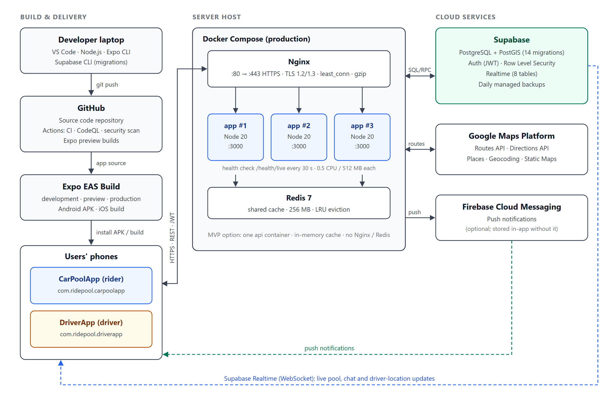

# Chapter 5

# Project Implementation

This chapter explains how RidePool was actually built and how it is run. It first recaps the architecture and shows how each part was implemented in code, then explains how the technology stack is deployed, and finally describes how to set up the development environment and run the whole system.

## 5.1 Overall Architecture Recap

RidePool has three running parts — the **rider app (CarPoolApp)**, the **driver app (DriverApp)** and the **server** — connected to a **Supabase** database and a few outside services (Figure 4.1 in Chapter 4). The apps send requests to the server's REST API; the server checks each request, runs the business logic and stores the result in the database; live changes flow back to the apps through Supabase Realtime.

### 5.1.1 Project Structure

The code is kept in one Git repository with four separate packages. There is **no root workspace**: each package has its own `package.json` and is installed and run from its own folder.

```
RidePool-MVP/
├── Server/                  Node.js + Express + TypeScript API
│   ├── src/
│   │   ├── routes/          16 route files (one per API module)
│   │   ├── controllers/     17 controllers
│   │   ├── services/        24 services (matching, fare, wallet, ...)
│   │   ├── middleware/      8 middleware (auth, rate limit, sanitizer, ...)
│   │   ├── config/          environment and constants
│   │   └── utils/           H3 helpers, gender rule, time windows, ...
│   ├── supabase/migrations/ 14 SQL migration files
│   ├── tests/               15 test files (Vitest)
│   ├── nginx/               reverse-proxy configuration
│   └── Dockerfile, docker-compose.yml, docker-compose.mvp.yml
├── Client/
│   ├── CarPoolApp/          rider app (Expo, 33 screen files, 64 components)
│   └── DriverApp/           driver app (Expo, 11 screen files, 73 components)
├── shared/                  common TypeScript data model
└── __docs__/                architecture, database, guides and diagrams
```

*Figure 5.1: Folder structure of the RidePool repository*

**Table 5.1: Size of each package**

| Package | Main contents | Language / framework |
|---------|---------------|----------------------|
| Server | 16 routes, 17 controllers, 24 services, 8 middleware, 7 utilities, 14 migrations, 15 test files | TypeScript, Express 5, Node.js 20 |
| CarPoolApp | 33 screen files, 64 components, 13 hooks, 9 API service files | TypeScript, React Native 0.81, Expo 54 |
| DriverApp | 11 screen files, 73 components, 4 API service files, 1 Zustand store | TypeScript, React Native 0.81, Expo 54 |
| shared | Type definitions for rides, pools, users, drivers, payments and messaging | TypeScript |

### 5.1.2 Server Implementation

The server starts in `src/app.ts`. Every request passes through the same chain of middleware **before** it reaches a controller:

**Table 5.2: Server request pipeline (in order)**

| Step | Middleware | What it does |
|------|-----------|--------------|
| 1 | Security headers (Helmet) | Adds safe HTTP headers to every response |
| 2 | Compression | Compresses responses to save mobile data |
| 3 | CORS | Allows only approved origins in production |
| 4 | Body parser | Reads JSON bodies, limited to **10 KB** per request |
| 5 | Request logging | Morgan writes every request to the Winston logger |
| 6 | Input sanitizer | Removes null bytes and unsafe characters from input |
| 7 | Health routes | `/health/live`, `/health/ready`, `/health/detailed`, `/health/cache` (not rate-limited) |
| 8 | Rate limiters | General limit on `/api`, stricter limits on login, pool search and payment/wallet |
| 9 | Routes → Controllers → Services | Authentication, validation (Zod) and business logic |
| 10 | Error handler | Turns any error into the standard error response |

When the server starts it (1) connects the cache — in-memory in MVP mode or Redis in production, (2) starts the **advance-booking scheduler**, which checks scheduled pools every 15 seconds, (3) starts listening on port 3000, and (4) registers a **graceful shutdown** handler so that open requests and the scheduler finish cleanly when the server stops.

**Core algorithm: pool matching.** The most important service is `poolMatching.service.ts`. It works in three passes:

1. **Candidate search (database):** find open pools whose pickup H3 cell lies inside the rider's pickup ring (up to 6 rings ≈ 2.1 km), that still have a free seat and are still inside their search window. If none are found, the ring is widened and the search retried.
2. **Scoring (in memory):** each candidate gets a score out of 100 (Table 5.3). Pools scoring below **30** are dropped, and the rest are sorted by score and then by lower detour.
3. **Enrichment (Google Maps):** only the **top 10** pools get exact distance, ETA and route geometry, using one shared route request.

**Table 5.3: Pool matching score**

| Part of the score | Maximum points | How it is calculated |
|-------------------|----------------|----------------------|
| Route overlap | 35 | Share of the rider's route that overlaps the pool's route |
| Pickup distance | 25 | Closer pickup gives more points |
| Passenger fill | 20 | Fuller pools get more points, so pools fill up faster |
| Destination proximity | 10 | Closer destination gives more points |
| Same pickup hexagon | 5 | Bonus when both pickups are in the same H3 cell |
| Same destination hexagon | 5 | Bonus when both destinations are in the same H3 cell |
| **Total** | **100** | Pools below 30 points are not shown |

**Fare calculation** (`fare.service.ts`) uses fixed rates: a base of Tk 50 (CAR) or Tk 30 (CNG), Tk 15 per km and Tk 2 per minute. A pool discount of 25% (2 riders) or 35% (3 riders) is taken off, the total is split between the riders, and a Tk 10 platform fee is added to each rider's charge.

**Cancellation penalty** (`penalty.service.ts`): a cancellation made more than 30 seconds after booking counts as deliberate. Three deliberate cancellations within 5 minutes put the rider in a **7-minute cooldown**.

### 5.1.3 Mobile App Implementation

Both apps are built with **Expo** and **React Native**, so the same TypeScript code runs on Android, iOS and (for the rider app) the web.

**Table 5.4: Building blocks of the mobile apps**

| Building block | CarPoolApp (rider) | DriverApp (driver) |
|----------------|--------------------|--------------------|
| Screens and navigation | Expo Router, files in `app/` | Expo Router, files in `app/` |
| Global state | `AuthContext`, `GlobalContext`, `NotificationContext` | Zustand store `useDriverStore` (saved to the phone) |
| API calls | 9 service files (`pool`, `ride`, `payment`, `advanceBooking`, ...) | 4 service files (`auth`, `driver`, `location`, `notification`) |
| Live updates | Hooks `usePoolRealtime`, `useDriverLocationRealtime`, `useChatRealtime` | Hook `usePoolRealtime` |
| Styling | NativeWind (Tailwind CSS) | NativeWind (Tailwind CSS) |
| Maps | `react-native-maps`; Leaflet on web; static map in Expo Go | `react-native-maps` |
| Location | `expo-location` for the rider's position | `expo-location`, sends GPS every 5 s or 10 m |

The rider app also calls Google Maps directly for **place search** (Places Autocomplete and Text Search), **address lookup** (Geocoding) and for drawing a route line on its map. All other map work — matching, fares and pickup order — is done by the server.

### 5.1.4 Database Implementation

The database is **PostgreSQL on Supabase**. It is built entirely from SQL **migration files**, which run in a fixed order so the same database can be created again from scratch at any time.

**Table 5.5: Database migration files**

| Order | Migration | What it creates |
|-------|-----------|-----------------|
| 1 | `extensions` | PostGIS (location data) and pgcrypto (IDs) |
| 2–6 | `tables_identity`, `tables_rides`, `tables_money`, `tables_messaging`, `tables_ops` | The 30 tables, grouped as in the schema diagram |
| 7 | `foreign_keys` | All links between tables (49 foreign keys) |
| 8 | `indexes` | 73 indexes for fast searches (for example by H3 cell and status) |
| 9 | `functions` | 16 database functions, including the atomic ones |
| 10 | `triggers` | 14 triggers that keep `updated_at` current, fill the PostGIS location columns, update users' average rating, create referral codes and record cancellation times |
| 11 | `row_level_security` | Row Level Security on 29 tables with 43 access policies |
| 12 | `grants` | Permissions for the database roles |
| 13 | `realtime` | Publishes 8 tables to Supabase Realtime |
| 14 | `seed_app_metadata` | Initial app settings |

**Table 5.6: Main database functions**

| Function | Purpose |
|----------|---------|
| `atomic_join_pool` | Adds a rider to a pool with a row lock; checks capacity, pickup range, gender and duplicates |
| `atomic_accept_pool` | Gives a pool to exactly one driver (`SKIP LOCKED`) |
| `atomic_leave_pool` | Removes a rider and frees the seat safely |
| `atomic_assign_advance_booking` | Places a scheduled ride into a suitable advance pool |
| `atomic_confirm_advance_member` | Records a rider's confirmation and opens the pickup range at 2 confirmations |
| `atomic_wallet_debit` / `atomic_wallet_credit` | Moves wallet money and writes the transaction in one step |
| `atomic_process_payment`, `complete_payment`, `fail_payment` | Payment status changes |
| `vehicle_capacity` | Returns 2 for CNG and 3 for CAR — the single source of capacity |
| `update_vehicle_location` | Saves a driver's live position |

The **8 tables published to Realtime** are `pools`, `pool_members`, `rides`, `vehicle_locations`, `conversations`, `conversation_participants`, `messages` and `notifications`. These are exactly the tables whose changes the apps need to see live.

## 5.2 Technology Stack Deployment

### 5.2.1 Deployment Options

RidePool can be deployed in two ways, chosen with environment variables. Both use the same code.

**Table 5.7: Deployment options**

| | MVP deployment | Production deployment |
|---|---|---|
| Compose file | `docker-compose.mvp.yml` | `docker-compose.yml` |
| Server instances | 1 | 3 replicas |
| Cache | In-memory (`MVP_MODE=true`) | Redis 7 (shared by all instances) |
| Reverse proxy | None | Nginx with HTTPS |
| Resources per server | 0.5 CPU, 512 MB RAM (limit) | 0.5 CPU, 512 MB RAM (limit) each |
| Best for | Pilot and testing, up to about 1,000 daily users | Growth stage with more users |
| Main limitation | Cache is lost on restart and not shared | More services to run and monitor |



*Figure 5.2: Deployment of the RidePool stack*

Figure 5.2 shows where each part runs. The server, Redis and Nginx run in Docker containers on one host. The database, authentication and realtime service are hosted by Supabase in the cloud. Google Maps and Firebase Cloud Messaging are used as outside services. The mobile apps are built with Expo Application Services (EAS) and installed on users' phones.

### 5.2.2 Containerisation with Docker

The server is packaged as a Docker image using a **two-stage Dockerfile**:

1. **Build stage** (`node:20-alpine`): installs all packages and compiles TypeScript to JavaScript (`npm run build`).
2. **Production stage** (`node:20-alpine`): installs only the packages needed to run, copies the compiled `dist/` folder, and runs the server as a **non-root user** (`nodejs`). `tini` is used as the start process so the server shuts down cleanly.

The image has a built-in **health check** that calls `/health/live` every 30 seconds; if it fails three times, Docker marks the container as unhealthy so the problem can be seen and fixed. Logs are rotated (at most 3 files of 10 MB each) so the disk does not fill up.

### 5.2.3 Reverse Proxy and Load Balancing

In production, **Nginx** sits in front of the server containers:

- **HTTPS only:** Requests on port 80 are redirected to port 443. Only TLS 1.2 and 1.3 are allowed.
- **Load balancing:** Requests go to the server instance with the fewest active connections (`least_conn`); an instance that fails 3 times is taken out for 30 seconds.
- **Compression:** JSON and other text responses are compressed with gzip.
- **Extra rate limiting:** Nginx limits each IP address to 10 requests per second for the API and 1 per second for login, on top of the server's own limits.
- **Health checks:** `/health` requests are passed through without logging, so monitoring does not fill the logs.

### 5.2.4 Cloud and External Services

**Table 5.8: Hosted and external services**

| Service | Provider | Used for |
|---------|----------|----------|
| Database, Auth, Realtime, backups | Supabase (PostgreSQL + PostGIS) | All stored data, login tokens, live updates, daily backups |
| Routes and travel times | Google Maps Platform — Routes API (`computeRoutes`, `computeRouteMatrix`) and Directions API | Matching, fares, pickup order and ETA (server) |
| Place search and addresses | Google Places (Autocomplete, Text Search, Details) and Geocoding APIs | Searching for pickup and destination (rider app) |
| Map display | Maps SDK for Android/iOS, Static Maps API | Interactive maps; static map image in Expo Go |
| Push notifications | Firebase Cloud Messaging (FCM) | Sending notifications to phones |
| Code hosting and CI | GitHub and GitHub Actions | Version control and automated checks |
| App builds | Expo Application Services (EAS) | Building Android APKs and iOS builds |

### 5.2.5 Mobile App Builds and Distribution

Both apps are built with **EAS Build** using three build profiles:

**Table 5.9: EAS build profiles**

| Profile | Output | Use |
|---------|--------|-----|
| `development` | Development build (Android debug, iOS debug) | Daily development with full native maps |
| `preview` | Android APK, iOS simulator build (internal distribution) | Sharing test builds with the team and testers |
| `production` | Android APK, iOS release build | Final release to users |

The apps have their own identities: `com.ridepool.carpoolapp` for the rider app and `com.ridepool.driverapp` for the driver app. During quick testing the apps can also run inside **Expo Go**; because Expo Go does not include the native map module, the apps then show a **static map image** with an "Open in Google Maps" button instead of the interactive map.

### 5.2.6 Continuous Integration and Security Scanning

The repository contains **GitHub Actions** workflows that run automatically on pushes and pull requests to the `main`, `master` and `develop` branches:

**Table 5.10: GitHub Actions workflows**

| Workflow | What it does |
|----------|--------------|
| `ci.yml` — CI/CD Pipeline | Builds the server, runs the unit tests with coverage, type-checks and lints both apps, exports the rider app for the web, and runs an `npm audit` security check on all three packages |
| `codeql.yml` — CodeQL | Scans the code for security weaknesses |
| `security-scan.yml` — Security Scan | Semgrep code scan, Trivy scan of dependencies and the Docker image, TruffleHog secret scan, and an OWASP ZAP baseline scan |
| `e2e.yml` — E2E Tests | Prepared to start the server and run end-to-end and Playwright browser tests; the test files themselves are future work |
| `expo-preview.yml` — Expo Preview | Builds a preview version of the app for each pull request |

### 5.2.7 Current Deployment Status

At the time of writing, RidePool runs as a **development deployment**: the server runs on the development laptop in MVP mode, the database runs on the hosted Supabase project, and the rider and driver apps on Android phones connect to the server over the local Wi-Fi network. The Docker, Nginx and EAS configuration described above is ready for moving the server to a cloud host and publishing the apps, which is the next step before a public pilot.

## 5.3 System Setup and Environment

### 5.3.1 Development Environment

**Table 5.11: Development environment used**

| Item | Details |
|------|---------|
| Computer | Laptop with Intel Core i3-1315U, 16 GB RAM |
| Operating system | Windows 11 Pro |
| Runtime | Node.js 22 locally (Node.js 20 in Docker and CI), npm |
| Code editor | Visual Studio Code |
| Version control | Git, GitHub |
| Mobile tools | Expo CLI, Expo Go, EAS CLI, Android phone for testing |
| Database tools | Supabase dashboard and Supabase CLI |
| Browser | Google Chrome (web version and debugging) |

### 5.3.2 Installing the Project

Because there is no root workspace, each package is installed separately:

```bash
# 1. Get the code
git clone https://github.com/Rai-sul/RidePool-MVP.git
cd RidePool-MVP

# 2. Server
cd Server && npm ci && cd ..

# 3. Rider app and driver app
cd Client/CarPoolApp && npm ci && cd ../..
cd Client/DriverApp  && npm ci && cd ../..

# 4. Shared data model (optional)
cd shared && npm ci && npm run build
```

### 5.3.3 Environment Configuration

Settings and secret keys are kept in `.env` files that are **never committed** to Git. Each package has a `.env.example` file to copy from.

**Table 5.12: Main server environment variables**

| Variable | Example / default | Purpose |
|----------|-------------------|---------|
| `SUPABASE_URL`, `SUPABASE_ANON_KEY` | from Supabase dashboard | Connect to the database |
| `SUPABASE_SERVICE_ROLE_KEY` | from Supabase dashboard | Server-only key; never put in an app |
| `GOOGLE_MAPS_API_KEY` | from Google Cloud | Routes and Directions (server) |
| `PORT`, `NODE_ENV` | `3000`, `development` | Server port and mode |
| `MVP_MODE`, `SKIP_REDIS` | `true` | Use the in-memory cache, no Redis |
| `REDIS_URL` | `redis://localhost:6379` | Redis address (production only) |
| `H3_RESOLUTION_PICKUP` / `_DESTINATION` / `_DRIVER` | `9` / `7` / `8` | H3 cell sizes |
| `H3_SEARCH_RADIUS_PICKUP` / `_DESTINATION` | `6` / `2` | How many rings to search |
| `ADVANCE_TIME_UNIT` | `minutes` (`seconds` for testing) | Speed up advance-booking windows for QA |
| `ADVANCE_MAX_LEAD_DAYS` | `7` | How far ahead a ride can be booked |
| `FCM_SERVER_KEY` | from Firebase | Push notifications (optional) |

**Table 5.13: App environment variables**

| Variable | Purpose |
|----------|---------|
| `EXPO_PUBLIC_API_URL` | Server address, for example `http://<laptop-IP>:3000/api` on the local network |
| `EXPO_PUBLIC_GOOGLE_MAPS_API_KEY` | Maps key for the app (restricted to the app's bundle ID) |
| `EXPO_PUBLIC_SUPABASE_URL`, `EXPO_PUBLIC_SUPABASE_ANON_KEY` | Supabase Realtime connection |

### 5.3.4 Database Setup

1. Create a new project in the **Supabase** dashboard and copy its URL and keys into `Server/.env`.
2. Link the Supabase CLI to the project (`supabase link`).
3. Apply the 14 migration files in order:

```bash
cd Server
npm run migrate        # runs: supabase db push
```

4. Check the result: the database integration test confirms that the core tables, the atomic functions and PostGIS are all present.

```bash
npx vitest run tests/supabase-connection.test.ts
```

### 5.3.5 External Service Setup

1. **Google Cloud:** create an API key for the server and enable the **Routes API** and **Directions API**. Create a second key for the apps with the **Maps SDK for Android/iOS**, **Places**, **Geocoding** and **Static Maps** APIs, restricted to the apps' bundle IDs.
2. **Firebase (optional):** create a project and set `FCM_SERVER_KEY`. Without it, notifications are still saved and shown inside the app but are not pushed to the phone.
3. **Expo / EAS:** log in with `eas login` to build installable apps.

### 5.3.6 Running the System

**Table 5.14: Commands to run and check the system**

| Task | Command (run inside the package folder) |
|------|-----------------------------------------|
| Start the server in development mode | `cd Server` → `npm run dev` |
| Build and start the compiled server | `npm run build` → `npm run start` |
| Start the rider app | `cd Client/CarPoolApp` → `npx expo start --clear` |
| Start the driver app | `cd Client/DriverApp` → `npx expo start --clear` |
| Open on a phone / web | Scan the QR code with Expo Go, or press `a` (Android) / `w` (web) |
| Run all server tests | `cd Server` → `npm test` |
| Type-check an app | `npx tsc --noEmit` |
| Test scheduled rides quickly | Set `ADVANCE_TIME_UNIT=seconds` in `Server/.env` and restart the server |
| Check the server is running | Open `http://localhost:3000/health/ready` |
| Run the MVP Docker deployment | `cd Server` → `docker compose -f docker-compose.mvp.yml up` |
| Run the production Docker deployment | `cd Server` → `docker compose up` |

When the server starts correctly, its log shows the port, the environment, whether MVP mode is on, and the advance-booking time unit (minutes, or seconds in test mode).

### 5.3.7 Device Permissions

Both apps ask the user for the permissions they need to work:

**Table 5.15: App permissions**

| Permission | Why it is needed |
|------------|------------------|
| Location (while using the app) | Find the rider's pickup point; show the driver's position |
| Background location and location foreground service | Keep tracking the trip when the app is in the background |
| Notifications | Pool found, driver assigned, trip updates and chat messages |
| Internet and network state | Talk to the server and detect when the connection is lost |
| Vibrate, receive boot completed | Alerts for new pool requests; keep notifications working after the phone restarts |

On iOS, each location permission is shown with a short message explaining why RidePool needs it (for example, "to find nearby rides and drivers").
